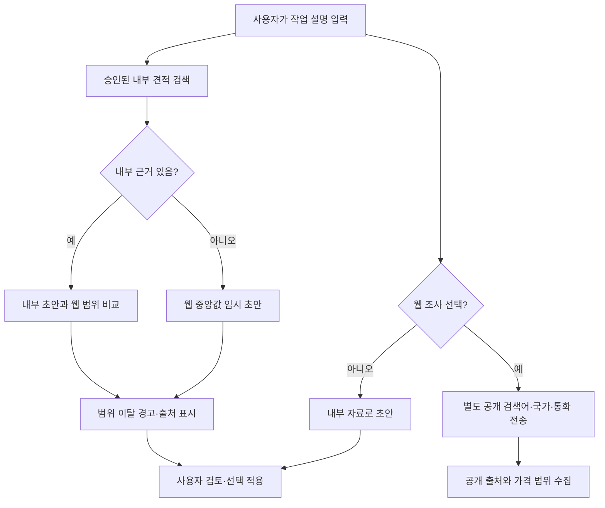
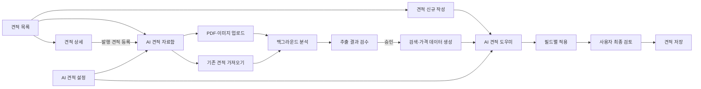
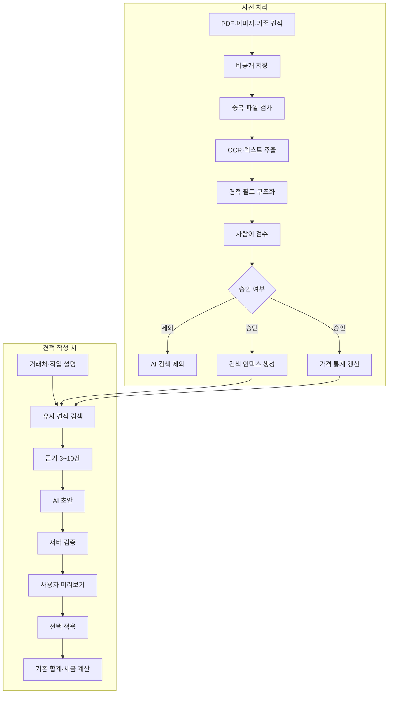
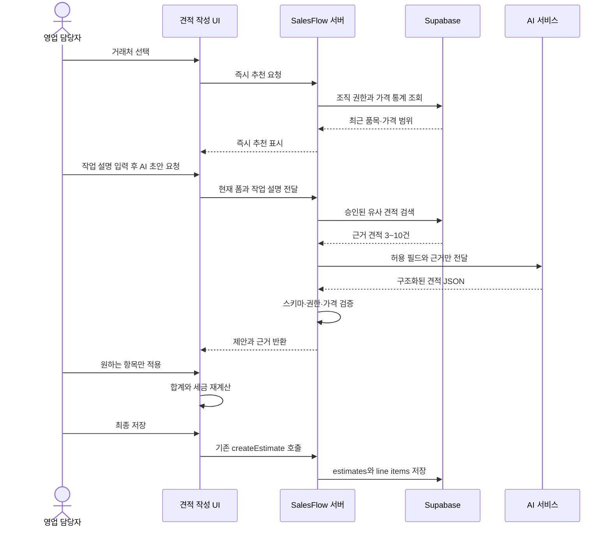
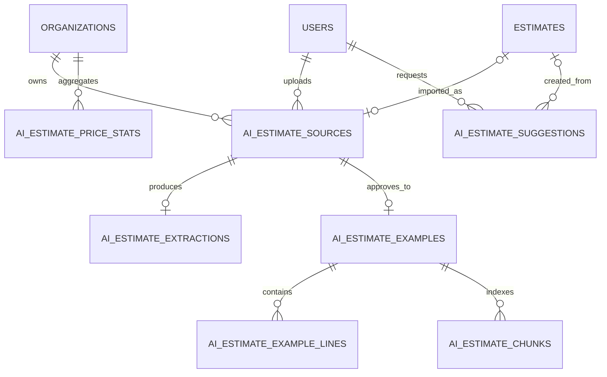

# SalesFlow AI 견적 자동작성 설계서

> 구현 메모: 2026-08-21 기준으로 조직별 비공개 저장소, 업로드, 검수·승인, 기존 견적 가져오기,
> 검색 인덱스·가격 통계, 견적 작성 화면의 추천·선택 적용, 선택형 공개 웹 시중가 조사, 운영 설정까지 구현했다.
> 종이 견적 원본을 외부 AI 사업자에게 보내는 OCR/생성 어댑터는 데이터 전송 동의 전까지 비활성화하며,
> 현재 업로드 파일은 사람이 원본과 비교해 구조화한 뒤 승인하는 안전한 기본 흐름을 사용한다.

> 대상: SalesFlow 원본 프로젝트  
> 문서 상태: 기획·설계  
> 핵심 범위: 과거 견적 수집 → 사전 분석 → 검수 → 즉시 추천 → AI 초안 → 사용자 적용

### 읽는 순서

- 기능을 빠르게 이해하려면: **1 → 3 → 4장**
- 개발 구조를 확인하려면: **5 → 7 → 8 → 10장**
- 구현 순서와 완료 기준을 보려면: **11 → 12장**

## 1. 한눈에 보기

### 우리가 만들 기능

종이 견적서, PDF, 이미지와 SalesFlow에서 발행한 견적서를 미리 분석해 둔다. 사용자가 새 견적서를 작성할 때 과거의 유사 견적과 가격을 찾아 제목, 품목, 수량, 단가, 비고를 제안한다.


### 가장 중요한 원칙

- AI가 과거 문서를 매번 처음부터 읽지 않는다.
- 문서는 업로드할 때 한 번 분석하고 검색 가능한 형태로 저장한다.
- AI는 초안만 제안하며 자동 저장·발행하지 않는다.
- 합계, 세금, 문서번호는 기존 SalesFlow 로직이 계산한다.
- 승인된 자료만 추천에 사용한다.
- 다른 조직의 데이터는 검색 결과에 절대 포함하지 않는다.
- 웹 시중가 조사는 조직 관리자가 허용하고 사용자가 요청별로 선택했을 때만 실행한다.
- 웹 조사에는 별도의 공개 검색어·국가·통화만 보내며 고객명, 내부 견적, 업로드 원본은 보내지 않는다.

### 선택형 웹 시중가 조사

내부 승인 자료를 우선 근거로 사용한다. 사용자가 선택하면 공개 웹의 현재 가격 범위를 추가로 조사해 내부 추천가와 비교한다. 웹 결과는 참고 정보이며 내부 단가를 자동으로 덮어쓰지 않는다. 내부 자료가 전혀 없을 때만 웹 중앙값으로 낮은 신뢰도의 임시 초안을 만들고, 사용자가 확인 후 적용한다.



데이터 경계:

- 전송 가능: 사용자가 별도 입력한 공개 검색어, 시장 국가, 통화
- 전송 금지: 고객명, 회사명, 내부 견적 품목·단가, 업로드한 PDF·이미지, 개인 정보
- 결과 저장: 검색어, 시장, 통화, 공개 출처, 가격 범위, 성공·실패 상태
- 적용 규칙: 항상 사람이 확인하며 자동 저장·발행하지 않음

### 사용자가 얻는 결과

예를 들어 사용자가 다음처럼 입력한다.

> A사 홈페이지 리뉴얼, 10페이지, 반응형, 관리자 기능 포함

SalesFlow는 다음을 제안한다.

- 견적 제목
- 추천 품목
- 수량과 단위
- 과거 단가 범위와 추천 단가
- 비고·납기 문구
- 참고한 과거 견적
- 추천 신뢰도

## 2. 용어 정리

| 용어 | 의미 |
|---|---|
| AI 견적 자료 | 업로드한 종이·PDF 견적 또는 SalesFlow의 기존 발행 견적 |
| 추출 | 문서에서 거래처, 제목, 품목, 수량, 단가 등을 읽는 과정 |
| 검수 | 사람이 원본과 추출 결과를 비교하고 수정하는 과정 |
| 승인 자료 | 검수가 끝나 AI 검색에 사용할 수 있는 견적 |
| 즉시 추천 | AI 호출 없이 DB 통계로 바로 보여주는 품목·가격 추천 |
| AI 초안 | 유사 견적을 근거로 AI가 만든 구조화된 견적 제안 |
| 근거 견적 | AI가 제안할 때 참고한 승인된 과거 견적 |

## 3. 사용자 흐름

### 전체 화면 흐름



### 흐름 A — 종이 견적 등록

1. 사용자가 `AI 견적 자료함`에서 PDF 또는 이미지를 업로드한다.
2. 시스템이 OCR과 표 분석을 백그라운드에서 수행한다.
3. 분석이 끝나면 `검수 필요` 상태가 된다.
4. 사용자가 원본과 추출 결과를 비교하고 잘못 읽은 내용을 수정한다.
5. 관리자가 승인하면 AI 검색과 가격 통계에 반영된다.

### 흐름 B — 기존 발행 견적 등록

1. 사용자가 견적 상세에서 `AI 자료로 등록`을 선택한다.
2. `estimates`와 `estimate_line_items`의 데이터를 AI 자료 형식으로 변환한다.
3. 관리자가 공개 범위와 내용을 검수한다.
4. 승인 후 검색 데이터에 반영한다.

기존 DB 견적은 이미 구조화되어 있으므로 OCR 과정이 필요 없다.

### 흐름 C — AI로 새 견적 작성

1. 사용자가 거래처를 선택한다.
2. 해당 거래처의 최근 품목과 가격 범위를 즉시 보여준다.
3. 사용자가 작업 설명을 입력한다.
4. `AI 초안 만들기`를 누른다.
5. AI가 유사 견적을 근거로 제목, 품목, 단가, 비고를 제안한다.
6. 사용자가 원하는 항목만 적용한다.
7. 기존 SalesFlow 계산과 검증을 거쳐 저장한다.

## 4. 구현 화면

### 화면 목록

| 화면 | 경로 | 역할 |
|---|---|---|
| 견적 목록 | `/[lang]/estimates` | AI 자료함 진입, 기존 견적 등록 상태 확인 |
| AI 견적 자료함 | `/[lang]/estimates/ai-library` | 업로드 자료와 기존 견적 관리 |
| 자료 업로드 | `/[lang]/estimates/ai-library/upload` | PDF·이미지 업로드 |
| 추출 결과 검수 | `/[lang]/estimates/ai-library/[sourceId]` | 원본과 AI 추출 결과 비교·승인 |
| 견적 신규 작성 | `/[lang]/estimates/new` | 즉시 추천과 AI 초안 사용 |
| 견적 수정 | `/[lang]/estimates/[id]/edit` | 기존 값과 AI 제안을 비교해 수정 |
| 견적 상세 | `/[lang]/estimates/[id]` | 발행 견적을 AI 자료로 등록 |
| AI 견적 설정 | `/[lang]/settings/ai-estimates` | 조직별 AI 정책과 사용량 설정 |

### 4.1 견적 목록

현재 `src/app/[lang]/estimates/estimates-list.tsx`를 확장한다.

상단 버튼:

- 기본 버튼: `견적서 작성`
- 보조 버튼: `AI 견적 자료함`
- 관리자 메뉴: `기존 견적 일괄 등록`

각 견적의 작업 영역:

- 발행된 견적: `AI 자료로 등록`
- 처리 중: `AI 분석 중`
- 검수 필요: `검수 필요`
- 승인 완료: `AI 등록됨`
- 초안 견적: AI 등록 버튼을 표시하지 않음

### 4.2 AI 견적 자료함

자료함은 모든 AI 견적 자료의 시작점이다.

상단 기능:

- `파일 업로드`
- `기존 견적 가져오기`
- 검색
- 상태 필터
- 자료 유형 필터
- 공개 범위 필터

목록에 표시할 정보:

| 항목 | 예시 |
|---|---|
| 자료명 | `A사_홈페이지_견적.pdf` |
| 자료 유형 | PDF / 이미지 / SalesFlow 견적 |
| 거래처 | A 주식회사 |
| 견적일 | 2026-08-01 |
| 상태 | 분석 중 / 검수 필요 / 승인됨 |
| 공개 범위 | 개인 / 조직 공용 |
| 업로더 | 홍길동 |
| 작업 | 검수 / 제외 / 삭제 / 재처리 |

### 4.3 자료 업로드

데스크톱에서는 다이얼로그로, 모바일에서는 전체 화면으로 제공한다.

UI 구성:

- 드래그 앤 드롭 영역
- 파일 선택 버튼
- 선택 파일 목록과 파일 크기
- 중복 파일 경고
- 공개 범위: `나만 사용`, `조직 공용 승인 요청`
- 선택 입력: 거래처, 견적일, 작업 유형 태그
- 업로드 진행률

업로드가 끝나도 바로 AI 자료로 사용하지 않는다. `분석 중`을 거쳐 반드시 검수 단계로 이동한다.

### 4.4 추출 결과 검수

사람이 가장 중요하게 확인해야 하는 화면이다.

```text
┌─────────────────────────────┬─────────────────────────────┐
│ 원본 PDF·이미지             │ AI가 읽은 결과              │
│                             │                             │
│ 확대·축소                   │ 거래처 / 제목 / 날짜        │
│ 페이지 이동                 │ 품목 / 수량 / 단위 / 단가   │
│                             │ 세금 / 비고 / 신뢰도        │
├─────────────────────────────┴─────────────────────────────┤
│ 제외 · 재처리                 임시 저장 · AI 자료 승인    │
└───────────────────────────────────────────────────────────┘
```

검수 규칙:

- 신뢰도가 낮은 필드는 주황색으로 강조한다.
- 원본 합계와 추출 합계가 다르면 빨간 경고를 표시한다.
- 거래처는 기존 `clients` 후보와 연결하되 자동 생성하지 않는다.
- 품목은 기존 `items` 후보를 보여주되 원문 값을 유지할 수 있다.
- 가격이 0이거나 품목명이 비어 있으면 승인 전에 경고한다.
- 조직 공용 승인은 조직 관리자만 할 수 있다.

모바일에서는 `원본`과 `추출 결과`를 탭으로 나눠 표시한다.

### 4.5 견적 신규·수정 화면의 AI 패널

신규와 수정 라우트는 모두 현재 `EstimateFormClient`를 사용한다. 따라서 AI 패널도 `src/app/[lang]/estimates/estimate-form-client.tsx`에 한 번만 연결한다.

> 별도로 남아 있는 이전 편집 UI에는 중복 구현하지 않는다.

화면 배치:

- 데스크톱: 오른쪽 360~420px sticky 패널
- 태블릿: 오른쪽 drawer
- 모바일: bottom sheet
- 패널을 닫으면 `AI 견적 도우미` 플로팅 버튼 표시

```text
┌────────────────────────────────────┬──────────────────────┐
│ 기존 견적 작성 폼                 │ AI 견적 도우미       │
│                                    │                      │
│ 거래처 / 날짜 / 제목              │ 작업 설명            │
│ 품목 / 수량 / 단가                │ 즉시 추천            │
│ 세금 / 비고 / 템플릿              │ AI 초안              │
│                                    │ 근거 견적            │
│                                    │ 필드별 적용           │
└────────────────────────────────────┴──────────────────────┘
```

AI 패널의 상태:

1. 거래처를 선택해 주세요.
2. 최근 품목과 가격 불러오는 중
3. 즉시 추천 표시
4. 작업 설명 입력
5. AI 초안 생성 중
6. AI 제안 표시
7. 적용한 필드 강조
8. 오류 발생 시 재시도

품목 제안 카드:

- 품목명
- 추천 수량과 단위
- 추천 단가
- 과거 가격 범위
- 참고한 자료 수
- 추천 이유와 신뢰도
- `추가`, `교체`, `무시`

AI 패널은 문서번호, 합계, 세금 합계, 발행 상태를 수정할 수 없다.

### 4.6 견적 상세

`src/app/[lang]/estimates/[id]/estimate-detail-client.tsx`의 상단 작업 버튼에 AI 자료 등록 기능을 추가한다.

| 견적 상태 | 표시 |
|---|---|
| `draft` | AI 등록 버튼 숨김 |
| `issued` | `AI 자료로 등록` |
| 처리 중 | `AI 분석 중` |
| 검수 필요 | `검수 필요` 링크 |
| 승인됨 | `AI 자료 승인됨` |

해당 견적을 작성할 때 AI를 사용했다면 `AI 제안 이력`도 표시할 수 있다. 모델의 전체 응답보다 적용한 필드, 근거 견적, 사용자의 최종 수정 여부를 보여준다.

### 4.7 AI 견적 설정

기존 설정 서브 내비게이션에 `AI 견적` 탭을 추가한다.

관리자가 설정할 항목:

- AI 견적 기능 활성화
- 발행 견적 자동 수집 여부
- 자동 수집 자료의 승인 방식
- 업로드 자료의 기본 공개 범위
- 가격 추천에 필요한 최소 표본 수
- 오래된 가격의 가중치 기준
- 원본 파일 보존기간
- 월별 AI 사용량 한도
- 현재 처리 모델과 장애 상태

API 키와 비밀 값은 화면이나 브라우저에 노출하지 않는다.

## 5. AI는 어떻게 빠르게 동작하는가

### 업로드할 때 미리 처리한다



### 즉시 추천과 AI 초안을 나눈다

| 구분 | 즉시 추천 | AI 초안 |
|---|---|---|
| 처리 방식 | DB 조회와 사전 통계 | 유사 견적을 AI에 전달 |
| 보여주는 내용 | 최근 품목, 가격 범위, 자주 쓴 비고 | 제목, 품목 조합, 설명 문구 |
| 목표 속도 | 300ms 이내 | 2~4초 |
| 모델 호출 | 없음 | 있음 |
| 실패 시 | 최근 데이터만 표시 | 즉시 추천은 계속 사용 가능 |

AI 호출이 실패해도 과거 품목과 가격을 불러오는 기본 추천은 계속 사용할 수 있다.

### 견적 초안 생성 과정



## 6. 가격 추천 원칙

AI가 근거 없이 가격을 만들어서는 안 된다.

가격 추천 순서:

1. 동일 거래처의 동일·유사 품목을 먼저 찾는다.
2. 자료가 부족하면 같은 조직의 유사 품목을 찾는다.
3. 최근 견적에 더 높은 가중치를 준다.
4. 지나치게 높거나 낮은 값은 제외한다.
5. 중앙값과 25~75% 가격 범위를 계산한다.
6. AI는 가격을 선택한 이유를 설명한다.
7. 표본이 3건 미만이면 단가 자동 적용을 기본적으로 금지한다.
8. 근거가 부족하면 `가격 근거 부족`을 표시한다.

예시:

```text
웹 디자인
추천 단가: 300,000엔
과거 범위: 260,000~320,000엔
근거: A사 유사 견적 4건
최근 사용: 2026-07-12
```

수량과 단가를 적용한 뒤 합계와 세금은 기존 SalesFlow 계산 로직으로 다시 계산한다.

## 7. 데이터 구조

### 기존 견적과 AI 자료를 분리한다

종이·PDF 견적은 실제 `estimates`에 넣지 않는다. 별도의 AI 자료 테이블에 저장한다.

| 테이블 | 역할 |
|---|---|
| `ai_estimate_sources` | 업로드 파일과 기존 견적의 출처·상태 관리 |
| `ai_estimate_extractions` | OCR 원문과 검수 전 추출 결과 |
| `ai_estimate_examples` | 검수·승인된 견적 헤더 |
| `ai_estimate_example_lines` | 검수된 품목·수량·가격 |
| `ai_estimate_chunks` | 의미 검색용 텍스트와 벡터 |
| `ai_estimate_price_stats` | 즉시 추천용 가격 통계 |
| `ai_estimate_suggestions` | AI 제안, 근거, 사용자 적용 결과 |

### 관계 요약



### Storage

기존 `document-assets`와 분리된 비공개 버킷을 사용한다.

```text
ai-estimate-sources/
└── {organizationId}/
    └── {sourceId}/
        └── original.{extension}
```

저장 원칙:

- PDF, JPG, PNG만 지원
- 공개 URL 금지
- 짧은 만료시간의 signed URL 사용
- 파일 해시로 중복 업로드 방지
- Storage 첫 번째 폴더를 `organization_id`로 고정
- 삭제 시 검색 인덱스와 가격 통계에서도 제거

## 8. 권한과 보안

SalesFlow 원본은 멀티테넌트 SaaS이므로 조직 격리가 가장 중요하다.

### 필수 규칙

- 모든 AI 테이블에 `organization_id`를 둔다.
- 브라우저가 보낸 조직 ID를 신뢰하지 않는다.
- 서버가 로그인 사용자의 조직을 직접 확인한다.
- 일반 검색과 벡터 검색 모두 조직 필터를 강제한다.
- AI API 키는 서버 또는 백그라운드 워커에서만 사용한다.
- 원본 PDF는 공개하지 않는다.
- 근거 견적을 보여주기 전에 열람 권한을 다시 확인한다.
- 승인되지 않은 OCR 결과는 AI 추천에 사용하지 않는다.

### 권한 기준

| 기능 | 일반 구성원 | 업로더 | 조직 관리자 |
|---|---:|---:|---:|
| 승인된 조직 자료로 추천 받기 | 가능 | 가능 | 가능 |
| 본인 비공개 자료 사용 | 불가 | 가능 | 가능 |
| 원본 파일 열람 | 불가 | 가능 | 가능 |
| 본인 추출 결과 수정 | 불가 | 가능 | 가능 |
| 조직 공용 자료 승인 | 불가 | 불가 | 가능 |
| 자료 삭제 | 불가 | 가능 | 가능 |

### 업로드 문서는 신뢰하지 않는다

PDF나 이미지에 포함된 문장은 외부 데이터다. 문서 안에 AI를 조종하는 지시문이 있어도 실행하지 않는다. 정의된 견적 필드만 추출하고, 결과는 서버 스키마로 검증한다.

## 9. AI 응답 형식

AI는 자유 형식 문장이 아니라 정해진 JSON만 반환한다.

```json
{
  "subject": "A사 홈페이지 리뉴얼",
  "lines": [
    {
      "name": "웹 디자인",
      "qty": 1,
      "unit": "식",
      "unitPrice": 300000,
      "taxCategory": "standard_10",
      "confidence": 0.88,
      "reason": "최근 유사 견적 4건의 중앙값 기준"
    }
  ],
  "templateMessage": "아래와 같이 견적드립니다.",
  "remarks": "납기는 발주 후 30영업일입니다.",
  "evidence": [
    {
      "exampleId": "00000000-0000-0000-0000-000000000000",
      "label": "2026년 A사 홈페이지 구축 견적",
      "similarity": 0.91
    }
  ],
  "warnings": []
}
```

서버는 AI 응답을 런타임 스키마로 검사하고, 폼에 적용할 때 기존 `createEstimateSchema`로 다시 검증한다.

AI가 변경할 수 없는 값:

- 견적서 번호
- 최종 합계와 세금 합계
- 발행 상태
- 공유 토큰
- 작성자 ID
- 조직 ID

## 10. 권장 코드 배치

```text
src/
├── app/[lang]/estimates/
│   ├── ai-library/
│   │   ├── page.tsx
│   │   ├── ai-library-client.tsx
│   │   ├── upload/page.tsx
│   │   └── [sourceId]/
│   │       ├── page.tsx
│   │       └── ai-estimate-review-client.tsx
│   └── estimate-form-client.tsx
├── app/[lang]/settings/ai-estimates/
│   ├── page.tsx
│   └── ai-estimate-settings-form.tsx
├── components/ai-estimates/
│   ├── ai-estimate-panel.tsx
│   ├── ai-suggestion-card.tsx
│   ├── ai-evidence-list.tsx
│   ├── ai-source-upload-dialog.tsx
│   ├── ai-source-status-badge.tsx
│   ├── ai-extraction-editor.tsx
│   └── ai-price-range.tsx
├── lib/actions/ai-estimates.ts
├── lib/db/ai-estimates.ts
├── lib/ai/estimates/
│   ├── extract.ts
│   ├── retrieve.ts
│   ├── generate.ts
│   ├── normalize.ts
│   └── schemas.ts
└── lib/validators/ai-estimate.ts
```

책임 분리:

| 위치 | 책임 |
|---|---|
| 라우트 | 권한 확인, 초기 데이터 로딩, 화면 조립 |
| Client 컴포넌트 | 업로드, 검수, 제안 적용 UI |
| Server Action | 권한 재검사, 저장, AI 요청 시작 |
| `lib/db` | Supabase 조회·저장 |
| `lib/ai` | 추출, 검색, 정규화, AI 생성 |
| Validator | 업로드·OCR·AI 응답 검증 |

권장 서버 기능:

- `createAiEstimateUpload`
- `completeAiEstimateUpload`
- `retryAiEstimateExtraction`
- `updateAiEstimateExtraction`
- `approveAiEstimateSource`
- `excludeAiEstimateSource`
- `deleteAiEstimateSource`
- `importExistingEstimateAsAiSource`
- `getImmediateEstimateRecommendations`
- `generateAiEstimateDraft`
- `recordAiEstimateFeedback`

OCR와 AI 분석은 오래 걸릴 수 있으므로 Next.js 요청 안에서 완료하지 않는다. Server Action은 작업을 등록하고 별도 워커가 백그라운드 처리한다.

## 11. 단계별 구현 계획

### Phase 1 — 자료함 기반

만드는 것:

- 전용 Storage와 RLS
- AI 자료 테이블
- AI 견적 자료함
- 업로드 UI
- 자료 상태·삭제·제외

완료 기준:

- 사용자가 PDF·이미지를 안전하게 업로드할 수 있다.
- 다른 조직은 파일과 DB 행을 볼 수 없다.

### Phase 2 — OCR와 검수

만드는 것:

- 백그라운드 추출 작업
- 원본/추출 결과 비교 화면
- 헤더와 품목 수정
- 승인·재처리
- 중복 파일 검사

완료 기준:

- 사람이 잘못 읽은 필드를 수정하고 승인할 수 있다.
- 승인 전 자료는 검색되지 않는다.

### Phase 3 — 사전 검색 데이터

만드는 것:

- 품목명 정규화
- 검색 인덱스
- 가격 통계
- 기존 발행 견적 가져오기
- 승인·수정·삭제 시 인덱스 갱신

완료 기준:

- 거래처 선택 후 최근 품목과 가격 범위를 즉시 조회할 수 있다.

### Phase 4 — 견적 작성 연동

만드는 것:

- `EstimateFormClient` AI 패널
- 작업 설명 기반 유사 견적 검색
- 구조화된 AI 초안
- 필드별·전체 적용
- 근거와 신뢰도 표시

완료 기준:

- 사용자가 AI 제안을 선택 적용한 뒤 기존 견적 저장까지 완료할 수 있다.
- AI 실패 시에도 일반 견적 작성은 정상 동작한다.

### Phase 5 — 운영과 개선

만드는 것:

- 적용·거부 피드백
- 정확도·사용량 대시보드
- 조직별 비용 제한
- 모델·프롬프트 버전 관리
- 가격 이상치 감지
- 감사 로그와 실패 작업 재처리

## 12. 테스트와 완료 조건

### 초기 검증 데이터

실제 견적 30~50건을 사람이 정답 데이터로 만든다.

### 확인할 지표

- 거래처와 날짜 추출 정확도
- 품목 행 인식 정확도
- 수량·단위·단가 추출 정확도
- 원본 합계와 추출 합계 일치율
- 유사 견적 검색 적합성
- 추천 단가 적용률
- AI 제안 후 사용자 수정량
- 즉시 추천 응답 시간
- AI 초안 응답 시간
- 조직 간 데이터 노출 여부

### MVP 완료 조건

- PDF·이미지를 업로드할 수 있다.
- 사람이 원본과 추출 결과를 비교·검수할 수 있다.
- 승인된 자료만 추천에 사용된다.
- 견적 작성 시 유사 견적과 가격 범위를 바로 볼 수 있다.
- AI가 제목, 품목, 단가, 비고 초안을 생성한다.
- 사용자가 원하는 항목만 폼에 적용할 수 있다.
- 기존 검증, 합계, 세금 계산을 그대로 사용한다.
- AI가 견적을 자동 저장·발행·공유하지 않는다.
- 근거 견적과 신뢰도를 확인할 수 있다.
- 서로 다른 조직의 데이터가 섞이지 않는다.

## 13. 1차 제외 범위

- 모델 파인튜닝
- 자동 견적 저장·발행
- 자동 이메일 발송
- 계약서 자동 생성
- 청구서·발주서 AI 자동작성
- 완전한 손글씨 견적 인식
- 외부 회계 서비스 연동
- 조직 간 데이터 공유

## 14. 구현 전에 결정할 항목

| 결정 항목 | 권장 시작값 |
|---|---|
| OCR·AI 제공자 | 한 제공자로 고정하지 않고 인터페이스로 분리 |
| 조직 공용 승인자 | 조직 관리자 |
| 가격 추천 최소 표본 | 3건 |
| 지원 파일 | PDF, JPG, PNG |
| AI 적용 방식 | 필드별 적용 + 전체 적용 |
| 자동 수집 대상 | 발행된 견적만 |
| 모델 장애 시 | 즉시 추천만 제공하고 일반 작성 유지 |
| 원본 보존기간 | 조직 설정으로 관리 |

1차 목표는 `자료를 많이 넣는 것`이 아니라 `검수된 과거 견적을 근거로 사람이 안심하고 사용할 수 있는 초안을 빠르게 만드는 것`이다.
