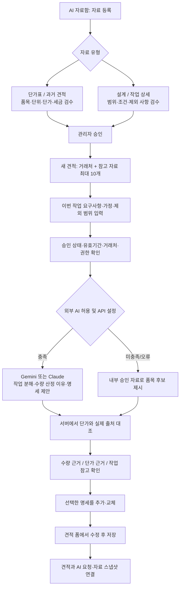

# AI 견적의 자료 저장·검색·산출 흐름

2026-09-24 구현 기준. 이 문서는 자료 유형과 견적 작성 동선을 설명하며, 기존 [RAG 운영 안내](AI_ESTIMATE_RAG.md)의 자료/생성 흐름을 확장한다. 운영 DB 적용 및 실제 유료 API 호출 결과는 로컬 코드·계약 검사와 구분한다.

API 키를 넣어 직접 실행할 검증 명령·합성 단가표/PDF·기대값은 [API 검증 실행 가이드](AI_ESTIMATE_API_VALIDATION.md)에 있다.

## 사용자가 따라가는 흐름



AI 자료함은 `/estimates/ai-library`, 등록은 `/estimates/ai-library/upload`에 있다. 승인 자료 상세의 **이 자료로 견적**은 `/estimates/new?aiSource=...`로 이어져 해당 자료를 선택한 상태로 연다. 거래처가 연결된 자료는 기존 거래처 초기 선택도 함께 전달한다.

## 자료를 어떤 형태로 보관하는가

| 층 | 저장 위치 | 내용과 역할 |
| --- | --- | --- |
| 원본 | 비공개 Storage `ai-estimate-sources` | PDF·이미지·CSV·XLSX·TXT·Markdown 원본. 조직/자료 ID별 경로, 파일명·크기·해시 기록 |
| 등록 정보 | `ai_estimate_sources` | 자료 유형, 프로젝트명, 버전, 참조 유효 시작/종료일, 공개 범위, 업로더, 검수 상태 |
| 검수 내용 | `ai_estimate_extractions` | 추출된 명세와 작업 내용·가정·제외 사항. 자동 추출 후 사람이 확인·수정 |
| 승인 스냅샷 | `ai_estimate_examples`와 명세 테이블 | 검수 당시 내용과 메타데이터. 설계·작업 자료에는 가격 명세를 저장하지 않음 |
| 검색 인덱스 | `ai_estimate_chunks` | 승인 내용의 검색 청크. 내부 문자 검색은 기본 제공, 동의·Gemini 설정 시 벡터 보강 |
| 생성 기록 | `ai_estimate_suggestions` | 입력 조건·선택 자료·AI 초안·자료/가격 근거 스냅샷·사용 공급자와 모델·연결 견적 ID |

프로젝트명은 자료를 찾고 함께 선택하기 위한 분류다. 같은 이름이라고 자동으로 모든 파일을 전송하지 않는다. **실제 사용 집합은 견적 요청의 선택 자료 ID들**이며, 빈 선택은 승인 자료 자동 검색을 뜻한다. 직접 선택하면 그 집합 밖의 가격을 통계에 섞지 않는다.

자료 유형은 파일 업로드/앱 견적 가져오기/텍스트 입력이라는 유입 경로와 별도로 저장한다.

| 유형 | 검수할 핵심 | 산출 시 역할 |
| --- | --- | --- |
| 단가표 | 품목, 기준 단위, 단가, 세금 포함 여부·세율, 적용 거래처, 조건, 버전·기간 | 일치하는 품목의 지정 단가 |
| 과거 견적 | 당시 작업 범위, 수량, 단위, 실제 단가, 세금, 거래처 | 작업 구성과 실제 가격 이력·통계 |
| 설계 | 화면·도면·규격·산출물·조건 | 이번 작업의 범위 및 수량 산정 참고 |
| 작업 상세 | 작업 단계, 제공 자료, 전제 조건, 포함/제외 범위 | 작업 누락·중복·가정 검토 |

가격 자료는 최소 1개 명세, 확정된 세금 기준과 검수된 가격이 있어야 승인된다. 설계·작업 자료는 가격 명세 없이 본문을 검수해 승인한다. 가격 없는 설계서에 가짜 1엔 명세를 만들 필요가 없다.

메타데이터는 등록 이후 불변으로 보존한다. 변경은 **새 버전 등록 → 검수·승인 → 이전 버전 제외** 순서다. 같은 파일이라도 버전·프로젝트·참조 유효기간이 다르면 별도 자료로 등록할 수 있다. 이전/새 단가표가 동시에 유효하고 같은 품목 가격이 다르면 자동 선택하지 않고 확인을 요구한다.

여기의 참조 유효기간은 ‘이 자료를 새 AI 견적에 사용할 기간’이다. 과거 견적서에 적힌 고객 제출용 견적 유효기한과 구분하며, 기존 문서 유효기한 데이터는 별도로 보존한다.

## 파일을 읽는 방법

- PDF·PNG·JPEG: 선택된 추출 공급자에 원본을 보내 구조화한다. 조직의 외부 처리 허용 및 해당 API 키가 필요하다. 추출 실패나 미설정 시 원본을 보며 수동 검수한다.
- CSV·XLSX: 단가표·과거 견적용 표를 서버가 읽는다. 지원 열 이름과 샘플은 등록 화면에 제공한다. 필수 열 누락, 잘못된 숫자, 일반/경감 구분이 없는 8% 세율, 수식 셀이 있으면 파일 전체의 자동 파싱을 중단하고 오류 안내와 빈 수동 검수 양식을 제공한다. 유효한 행만 부분 저장하지 않는다. 세금 포함 여부만 미지정된 경우에는 명세와 경고를 보존하며 검수 단계에서 확정한다. 단가표에서 수량을 생략하면 기준 수량 1로 읽는다.
- TXT·Markdown: UTF-8 텍스트를 설계·작업 본문으로 읽으며, 공백 정리 후 본문은 3~16,000자여야 한다. 직접 붙여넣어 등록하는 동선도 제공한다. CSV도 UTF-8 인코딩이 필요하다.
- 업로드 한도는 파일당 20MiB(화면 표기 20MB), 가격 명세는 최대 80행이다. Claude 이미지 추출에는 별도로 base64 변환 후 10MiB 한도(원본 약 7.5MiB)가 적용되며, 초과하면 전송 없이 이미지 축소·PDF 변환·수동 검수를 안내한다.
- XLSX는 최대 10시트의 비어 있지 않은 모든 시트를 읽으며 명세는 전체 시트 합계 80행까지다. 각 시트에 지원 헤더가 있어야 하고 최대 50열까지 허용한다. 압축 파일 디렉터리에 선언된 압축 해제 크기 합계가 64MiB를 넘거나 수식 셀이 있으면 자동 파싱하지 않는다. 표·본문이 한도를 넘으면 잘라 저장하지 않고 수동 검수로 전환한다.

CSV/XLSX/텍스트 처리 자체는 외부 API가 필요 없다. 파일을 읽었다는 사실과 내용이 승인됐다는 사실은 별개이며, 모든 자료는 승인 경계를 거친다.

## AI가 실제로 받는 데이터

모델이 DB에 직접 접속하거나 모든 원본 파일을 매번 읽는 방식이 아니다. 서버가 권한과 자료 상태를 확인한 뒤, **이번 요청에 필요한 승인 내용**을 JSON으로 전달한다.

1. 이번 견적의 제목·작업 설명·상세 요구사항·가정·제외 범위·세금 기준·언어.
2. 선택 또는 검색된 승인 자료의 유형·제목·버전·참조 기간·작업 내용·조건.
3. 가격 자료의 품목명·단위·단가·세금 기준과 관련 통계.
4. 모델이 반환할 명세·수량 산정 이유·주의 사항의 응답 형식.

외부 생성에 보낼 JSON 전체가 120,000자를 넘으면 API를 호출하지 않고 내부 승인 자료의 후보로 전환한다. 이 경우 자료 선택을 줄여 재시도하라는 안내를 표시한다. 자료를 최대 10개 선택할 수 있어도 본문 길이에 따라 이 한도에 도달할 수 있다.

내부 UUID는 외부 프롬프트에서 제외하고 자료 인덱스를 사용한다. 알려진 거래처명·이메일·전화 패턴도 치환한다. 원본 분석은 원본 자체를 보내므로 이 치환 범위와 다르다. 선택 자료 안의 지시문은 시스템 지시로 실행하지 않고 참고 데이터로 취급한다.

문자 검색과 벡터 검색은 자료를 찾는 수단이고, ‘모델 학습’이나 파인튜닝이 아니다. 자료를 수정·제외하면 승인 예제와 인덱스를 무효화한다. 생성 완료 및 초안 적용 전에 현재 승인·기간·접근 상태를 다시 확인하여 오래된 응답을 무조건 재사용하지 않는다.

## 가격과 수량을 확정하는 경계

**단가 우선순위:** 현재 사용 가능한 단가표 → 호환되는 과거 견적 통계 → 일치하는 과거 견적 명세 → 근거 부족.

단위, 통화, 세금 포함 여부, 세율과 품목명이 맞아야 한다. 특정 거래처용 단가표는 해당 거래처에만 적용한다. 단가표는 과거 견적의 통계 표본에 섞지 않는다. 단가표 간 충돌은 평균이나 최신 문자열 정렬로 감추지 않는다.

Gemini/Claude가 작성한 금액과 출처는 서버가 대조한다. 근거 없는 단가는 0으로 표시하며 기본 선택에서 제외한다. 0원은 무료 확정 가격이 아니라 사용자의 확인·입력이 필요한 상태다. 공개 웹 조사 결과로 내부 단가를 대체하지 않는다.

수량은 모델이 작업 내용에 맞춰 제안하고 **수량 산정 이유**를 별도 표시한다. AI가 적은 산정 이유 자체를 검증된 사실로 취급하지 않는다. 내부 검색 모드의 수량은 참고값이며 단가표에서 시작한 행은 임시 수량 1로 표시한다. 사용자가 작업량과 규격을 확인하고 견적 폼에서 수정한 뒤 저장한다. 복잡한 수량 할인·재료 손실률·공수 환산 규칙은 현재 자동 계산 엔진으로 구현한 범위가 아니며 자료의 조건과 결과 검토를 통해 확인한다.

최종 합계·세금·문서번호는 기존 문서 저장 로직이 계산한다. AI가 발행·전송을 수행하지 않는다. AI 초안 적용 기록과 실제 견적 저장을 연결하되, 최종 문서는 사용자가 수정한 값이며 원래 AI 제안과 같다고 가정하지 않는다.

## Gemini / Claude 연결 설정

서버 환경에서 키와 모델을 지정한다. API 키는 브라우저 입력이나 프롬프트에 포함하지 않는다. 아래 예시의 빈 API 키에는 서버의 비밀 환경변수로 실제 키를 설정한다. 모델 값은 현재 코드의 기본값이며, 모델 환경변수를 생략해도 같은 값이 적용된다. 계정에서 다른 모델을 사용할 때만 사용 가능한 실제 모델 ID로 바꾼다.

Gemini로 생성과 추출을 모두 처리하는 예시:

```dotenv
AI_ESTIMATE_GENERATION_PROVIDER=gemini
AI_ESTIMATE_EXTRACTION_PROVIDER=gemini
GEMINI_API_KEY=
GEMINI_ESTIMATE_MODEL=gemini-3.8-flash
GEMINI_EXTRACTION_MODEL=gemini-3.5-flash-lite
```

Claude로 생성과 추출을 모두 처리하는 예시:

```dotenv
AI_ESTIMATE_GENERATION_PROVIDER=anthropic
AI_ESTIMATE_EXTRACTION_PROVIDER=anthropic
ANTHROPIC_API_KEY=
ANTHROPIC_ESTIMATE_MODEL=claude-opus-5-5
ANTHROPIC_EXTRACTION_MODEL=claude-opus-5-5
# 여러 workspace에 접근하는 키인 경우에만 실제 workspace ID를 설정한다.
# ANTHROPIC_WORKSPACE_ID=
```

생성과 원본 추출의 공급자는 독립적으로 선택한다. 예를 들어 생성은 `anthropic`, 추출은 `gemini`로 설정할 수 있다. `AI_ESTIMATE_EXTRACTION_PROVIDER=auto`는 설정된 키에 따라 공급자를 고르며 Gemini와 Claude 키가 모두 있으면 Gemini를 우선한다. 생성 공급자를 `gemini`로 고정한 상태에서 Claude 키만 추가해도 자동 생성 공급자가 Claude로 바뀌지는 않는다.

견적 요청 화면에서 자동/Gemini/Claude를 선택한다. 이 선택은 견적 생성에만 적용되고, 이미 등록한 원본의 추출 공급자는 바꾸지 않는다. 화면의 자동 모드는 서버의 생성 공급자 설정을 따른다. 직접 선택한 공급자를 사용할 수 없거나 요청이 실패하면 내부 검색 후보로 전환하며 다른 공급자로 자동 재전송하지 않는다. 조직의 외부 처리 허용이 꺼져 있으면 외부 생성·추출·임베딩을 호출하지 않는다.

구조화 응답은 각 공급자가 지원하는 JSON Schema 범위에 맞춰 요청하고, 반환 후 애플리케이션 스키마로 다시 검증한다. Claude의 원본 인용 기능과 strict JSON을 혼합하지 않고 서버의 근거 ID 매핑을 사용한다. 공식 계약: [Gemini 구조화 출력](https://ai.google.dev/gemini-api/docs/structured-output), [Claude 구조화 출력](https://platform.claude.com/docs/en/build-with-claude/structured-outputs), [Claude API 인증](https://platform.claude.com/docs/en/api/overview), [Claude PDF 입력](https://platform.claude.com/docs/en/build-with-claude/pdf-support).

## 적용과 검증

DB 변경은 `0038_ai_estimate_document_kinds.sql`에 포함한다. 이전 마이그레이션 위에 순서대로 적용해야 한다.

- 단위 테스트: 207/207 통과.
- 전체 TypeScript 타입 검사, ESLint, Next.js 프로덕션 빌드: 성공.
- 실제 저장 결과 검사 21/21 통과: 요청과 승인 자료 2개, 근거 정책, 모델 원안의 수량 1과 최종 문서의 수량 5, 합계 및 이력 연결을 각각 확인했다.
- 자료 제외 후 보존 검사 15/15 통과: 기존 문서·요청·근거 스냅샷은 유지하고 새 검색에서는 제외했다. Chrome에서도 이전 초안 적용이 차단되고 새 초안을 만들라는 안내가 표시됐다.
- 새 격리 로컬 DB: 마이그레이션 `0001`~`0038` 순차 적용 및 SQL 회귀 검사 10개 파일 통과.
- Chrome 실제 UI: 설계·작업 조건 직접 등록 → 거래처 연결 → 검수·승인 → 단가표와 함께 선택 → 근거 확인 → 두 명세 적용 → 수량 수정 → 견적 저장 성공.
- 합성 단가표의 `画面設計` 50,000엔과 `開発` 80,000엔을 각각 5화면으로 확인·수정하여 소계 650,000엔, 세금 65,000엔, 합계 715,000엔 저장을 확인했다. 외부 AI 미연결 모드의 초안 수량은 임시값 1로 명확히 표시했다.
- 320·390·1440px에서 등록·검수·자료 선택·초안 화면을 확인했다. 모바일 금액·세금 표시를 의미 단위로 줄바꿈하며, 내부 검색 구현명은 사용자 화면에서 숨긴다. 최종 화면에서 세금 기준 불일치 시 0원·미선택 처리와 설계 자료만 선택했을 때의 단가표 추가 안내를 확인했다.

실제 UI 점검에서 발견한 새 조직의 설정 기본값 불일치(로컬 파일 처리 정지), 생성 안내를 일반 가격 입력 오류로 덮어쓰는 분류, 자료함에서 새 견적으로 이동할 때 거래처 누락을 수정했다. 직접 입력 자료의 추출 신뢰도 표시와 자료별 날짜 라벨도 정정했다. 긴 일본어·한국어 설명에 명시된 짧은 품목이 후보에서 빠지지 않도록 품목 기준의 검색 일치율을 추가하고, 관련 없는 품목의 제외도 회귀 검사했다. 최종 빌드의 Chrome 화면에서도 `画面設計と開発。税込で確認。` 입력으로 설계와 개발 두 후보가 모두 표시되는 것을 확인했다.

Chrome 확장의 파일 URL 접근 권한이 없어 파일 선택 창을 통한 업로드 완료는 검증하지 못했다. 대신 격리 서버에서 인증된 자료 등록·서명 업로드·Storage 다운로드·실제 CSV 파서·검수 대기 전이 전체를 실행했다. 추출 결과를 직접 DB에 주입하지 않았으며, 승인과 견적 반영은 Chrome UI로 수행했다.

자료 제외 확인창에서는 Chrome 제어가 응답하지 않아 앱과 같은 인증된 API 갱신 경로로 제외한 뒤, 기존 초안의 적용 차단을 Chrome에서 확인했다. 로컬 DB에서는 권한 없는 내부 함수를 직접 실행하는 별도 실패 경로 검사 중 PostgreSQL 종료가 재현되어 권한 검사와 실제 앱 RPC로 검사 범위를 나눴다. 이후 새 DB에 마이그레이션과 SQL 회귀 전체를 적용한 검사에서는 재발하지 않았다.

외부 공급자 계약 검사는 HTTP 모의 응답과 합성 자료로 수행했으며, 실제 Gemini·Claude 등 외부 API는 호출하지 않았다. 배포와 운영 DB 마이그레이션 적용은 수행하지 않았다.
