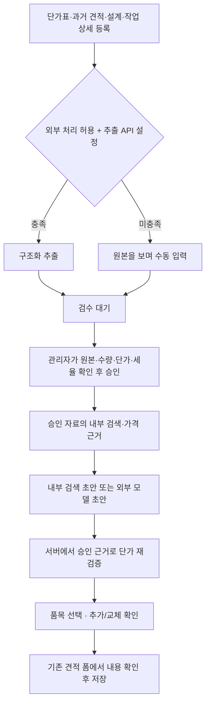

# AI 견적 RAG 구현 및 운영 안내

작성 기준: 2026-09-24. 자료 유형·버전·선택·Claude 연동·최종 견적 연결은 [자료 저장·산출 흐름](AI_ESTIMATE_DATA_FLOW_2026-09-24.md)을 함께 참조한다. 아래 2026-09-23 검증 표는 해당 시점의 기록이며 새 기능 검증 결과와 구분한다.

이 문서는 **현재 코드의 동작과 운영에 필요한 설정**을 설명한다. 프로덕션 배포나 운영 DB 마이그레이션 적용을 완료했다는 기록은 아니다. 실제 배포 대상, 적용한 마이그레이션, 외부 API 연결 결과와 최종 브라우저 검증 결과는 배포 기록에 별도로 남긴다.

[이전 자동작성 설계서](AI_ESTIMATE_AUTOFILL_DESIGN.md)와 [기존 배치 안내](salesflow-ai-estimate-batch.md)의 내용이 충돌하면 이 문서를 기준으로 삼는다. 이전의 **신뢰도에 따른 자동 승인**과 **내부 근거가 없을 때 웹 중앙값으로 견적을 만드는 제안**은 현재 동작에 포함되지 않는다. 자료는 반드시 관리자가 검수·승인하며, 웹 가격은 별도 참고 정보다.

## 1. 현재 제공하는 흐름



- 파일은 비공개 `ai-estimate-sources` 버킷에 보관한다. PDF/JPG/PNG/CSV/XLSX/TXT/Markdown, 파일당 최대 20MB다. 표·텍스트는 서버에서 직접 읽고 원본 이미지·PDF는 설정된 Gemini 또는 Claude로 추출한다.
- 견적 상세의 AI 자료 등록은 발행한 견적을 가져온다. 당시 수신자·단가·세금 스냅샷과 명세 순서를 보존한다.
- 추출 성공은 승인 완료를 뜻하지 않는다. 높은 신뢰도와 합계 일치도 검수를 생략하는 조건이 아니다.
- 외부 API가 없어도 업로드, 수동 검수, 승인, 내부 자료 검색, 근거 있는 초안과 견적 저장을 사용할 수 있다.
- 초안 적용은 견적 폼의 값을 바꾼다. 견적 저장·발행·이메일 전송은 사용자가 기존 기능에서 수행한다.
- 합계, 세금, 문서번호는 AI가 생성하지 않는다. 기존 문서 저장·계산 로직이 처리한다.

## 2. 화면에서 사용하는 방법

1. `/{lang}/estimates/ai-library`에서 자료를 등록한다. `lang`은 `ja`, `ko`, `en`이다. 검색어와 상태 필터로 검수 대기·실패·승인·제외 자료를 찾을 수 있다.
2. 업로드 화면에서 원본 전송 범위를 확인한다. 자동 추출이 설정되어 있지 않으면 수동 검수 안내가 표시된다. 파일 업로드나 등록이 실패하면 해당 자료 상태를 확인하거나 재시도한다.
3. 자료 상세에서 원본과 품목, 수량, 단위, 단가, 세율을 대조한다. 원본 단가의 세금 포함/별도 여부를 확정한다. 수량은 소수점 4자리까지, 단가는 엔 단위 정수이며 할인은 음수로 표현할 수 있다.
4. 임시 저장은 검수 내용을 보관한다. 가격 자료 승인에는 양수 수량, 0이 아닌 단가, 확정된 세금 구분이 필요하다. 설계·작업 자료는 가격 명세 없이 작업 본문을 승인한다. `follow_company` 상태로는 승인할 수 없다. 관리자가 원본 대조 확인란을 체크한 뒤 승인한다.
5. 견적 작성 화면에서 AI 견적 도우미를 열고 작업 설명을 입력한다. 현재 거래처와 견적의 세금 포함/별도 기준이 요청에 함께 반영된다.
6. 참고한 원본 자료 링크, 단가 근거, 범위와 표본 수를 확인한다. 필요한 명세를 선택하고 기존 명세에 추가하거나 명시적으로 교체한다. 근거가 부족한 행은 기본 선택되지 않는다.
7. 적용 결과를 기존 견적 폼과 미리보기에서 확인하고 저장한다. 한 초안을 반복해서 적용할 수 없고, 전체 명세는 80행을 넘길 수 없다.

기존 명세를 교체할 때는 확인 창을 표시한다. 제목·안내 문구·비고는 별도로 선택한 경우에만 교체하는 구조다. 현재 서버 초안은 과거 계약 문구를 옮기지 않도록 안내 문구와 비고를 비워 두며, 사용자가 입력한 제목을 우선 보존한다.

거래처·제목·작업 설명·세금 기준 등 요청 조건이 바뀌면 이전 응답을 적용할 수 없다. 검수 화면은 로드 당시의 `updated_at`을 저장 요청에 전달한다. 다른 작업이 먼저 자료를 변경하면 입력을 덮어쓰지 않고 최신 자료를 다시 검토하도록 안내한다.

## 3. 역할, 승인과 자료 수명주기

| 역할/상태 | 현재 허용 범위 |
| --- | --- |
| owner / admin | 조직 설정, 자료 검수·승인, 작성·검색·적용. 접근 가능한 조직 자료 관리 |
| member | 자료 등록, 본인 자료 검수 저장·재시도·제외/복원, 초안 생성·적용. 승인과 조직 설정 변경은 불가 |
| viewer | RLS로 허용된 자료 조회. 자료 변경·승인·초안 생성은 불가 |
| 조직 공용 승인 자료 | 같은 조직의 허용된 사용자에게 검색 근거로 제공 |
| 개인 자료 | 조직 설정에서 허용한 경우 소유자 자신의 추천에만 사용. 다른 구성원의 가격 통계에 혼합하지 않음 |
| 검수 대기 / 실패 / 제외 자료 | 추천과 가격 근거에서 제외 |

자료의 조직, 업로더, 공개 범위는 이후 임의로 바꿀 수 없도록 DB에서도 보호한다. 초안 요청 및 제안 이력은 같은 조직에 속했다는 이유만으로 다른 사용자가 조회할 수 없다.

승인은 `ai_estimate_approve_source` RPC에서 검수 데이터, 승인 예제, 명세, 검색 청크와 통계를 한 트랜잭션으로 갱신한다. 검수 내용 변경이나 자료 제외는 기존 승인 예제·청크·가격 근거를 무효화한다. 사람이 저장한 내용은 늦게 도착한 추출 작업이나 재시도가 덮어쓸 수 없다.

자료 제외는 원본을 즉시 삭제하는 동작이 아니다. 제외한 자료는 검수 대기로 복원하고 다시 승인할 수 있다. 원본 파일의 보관 기간은 별도 설정이며, 아래 운영 절차를 따른다.

## 4. 검색과 단가 근거를 만드는 규칙

### 검색

`ai_estimate_search_approved_v2` RPC가 현재 조직, 승인 상태, 공개 범위와 설정으로 대상 자료를 먼저 한정한다. 최근 자료 일부만 읽고 검색하는 방식이 아니라 DB의 승인 자료 집합에서 후보를 찾는다.

- 내부 문자 검색: NFKC 정규화 후 토큰을 비교한다. 일본어·한국어 등 CJK 문자열은 공백 없이도 검색할 수 있도록 2글자 단위 토큰을 사용한다.
- 벡터 검색: 외부 처리 동의와 Gemini 키가 있는 경우에만 검색어 임베딩을 요청한다. 저장된 임베딩과 모델 이름 및 1536차원 조건이 일치해야 한다.
- 현재 기준은 문자 일치 점수 0.25 이상 또는 벡터 유사도 0.65 이상이다. 같은 거래처라는 이유만으로 무관한 문서를 근거로 채택하지 않는다.
- 유효한 벡터 후보가 있으면 문자 0.4 + 벡터 0.6으로 계산하고, 같은 거래처에는 1.05 배수를 적용한다. 벡터가 없으면 문자 점수만 사용한다.
- 자동 검색은 후보를 정렬해 최대 10건을 전달하며, 직접 선택한 1~10개 자료는 선택 집합 전체를 검증해 사용한다. 임베딩 요청이나 벡터 RPC가 실패하면 내부 문자 검색을 시도한다.

관련 승인 자료가 없으면 자료 등록·승인 또는 작업 설명 보완을 안내한다. 내부 자료가 없는 상태에서 모델 지식이나 웹 시중가로 견적 단가를 만들어 내지 않는다.

### 가격 근거

외부 모델 결과와 내부 검색 초안 모두 `groundAiGeneratedEstimate`를 통과한다. 모델이 반환한 단가나 출처 ID를 그대로 신뢰하지 않는다.

0. **단가표 근거**: 현재 거래처·참조 기간에 적용되는 승인 단가표의 일치 품목 가격을 우선한다. 복수 단가표가 충돌하면 가격을 확정하지 않는다.
1. **통계 근거**: 정규화된 품목명, 단위, 통화, 세금 포함/별도와 세율이 일치하고 최소 표본 수를 충족하면 승인 자료의 중앙값을 사용한다. 참고 범위는 25~75 분위 값이다.
2. **과거 견적 근거**: 통계 표본이 부족하면 동일 품목·단위·통화·세금 기준을 가진 관련 승인 명세의 실제 단가를 사용한다. 통계 표본이 부족하다는 안내와 출처를 붙인다.
3. **근거 부족**: 일치하는 승인 가격이 없으면 단가를 0으로 표시하고 `insufficient`로 구분한다. 사용자가 금액을 직접 확인해야 하며 기본 선택에서 제외한다. 미확정 세율은 적용도 막는다.

통계의 표본 수는 명세 행 수가 아닌 문서 수다. 한 문서의 반복 명세가 표본 수를 부풀리지 않도록 먼저 문서별로 집계한다. 조직 공용 자료만 조직 통계에 포함하며, 단위·세금 기준이 다른 가격을 합치지 않는다. 현재 견적 초안 통화는 JPY다.

각 행에는 수량 산정 이유 `quantityReason`, `priceEvidence`, `evidenceExampleIds`, `evidenceLineIds`와 필요한 경우 `priceRange`를 남긴다. 사용자에게 제공하는 참고 자료 링크는 실제 `sourceId`로 만든다. 자료 제외·수정 후에는 현재 승인 상태를 기준으로 검색과 가격 근거를 다시 계산한다.

## 5. 외부 AI 사용과 데이터 범위

기본값 `allow_external_processing=false`에서는 추출·임베딩·생성 요청을 보내지 않는다. 관리자의 허용과 해당 서버 API 설정이 모두 필요하다. 공개 웹 조사는 `allow_web_market_research`와 사용자의 요청별 체크를 별도로 요구한다.

| 기능 | 외부로 보내는 데이터 | 기본 경로/실패 시 동작 |
| --- | --- | --- |
| PDF·이미지 추출 | 원본 PDF·이미지와 추출 지시 | 미설정·미동의 시 수동 검수. 처리 실패는 재시도/검수 상태로 관리 |
| 검색어 임베딩 | 알려진 거래처명 등을 치환한 검색어 | 내부 문자 검색 |
| 승인 자료 임베딩 | 승인된 검색 청크의 텍스트 | 내부 검색 청크는 이미 존재하므로 문자 검색 유지; 재색인 가능 |
| 초안 생성 | 작업 설명, 승인 품목·가격·일부 문구 및 가격 통계 | 생성 실패·거절·불완전 응답은 내부 검색 초안으로 전환하고 실제 방식을 표시 |
| 공개 웹 조사 | 사용자가 별도 입력한 공개 검색어, 국가, 통화 | 실패 시 내부 초안 유지 및 안내. 웹 가격으로 내부 단가를 교체하지 않음 |

생성 컨텍스트에서 알려진 거래처명, 이메일·전화 형식을 치환하고 내부 UUID를 모델에 넘기지 않는다. 이 처리는 모든 개인정보나 기밀정보를 식별하는 기능이 아니므로 공개 전송에 적합한 자료와 설명을 사용해야 한다. 원본 추출은 원본 자체를 전송하므로 생성 컨텍스트의 치환과 구분한다.

초안 생성은 Gemini `generateContent`, Claude Messages의 JSON Schema 응답 또는 OpenAI Responses API의 strict structured output을 사용한다. 응답을 다시 스키마로 검증하고, 거절·중단·잘못된 JSON·네트워크 오류를 구분한다. OpenAI 요청의 `store:false`는 해당 요청 옵션이며, 모든 외부 사업자가 데이터를 보관하지 않는다는 약속으로 해석하지 않는다. API 응답 형식은 [OpenAI Structured Outputs](https://developers.openai.com/api/docs/guides/structured-outputs)와 [Gemini Structured outputs](https://ai.google.dev/gemini-api/docs/generate-content/structured-output)를 참고한다.

## 6. 서버와 조직 설정

아래는 변수 이름과 예시 설정이다. 실제 비밀키는 문서나 Git에 넣지 않는다. API 키와 service role 키는 서버/신뢰된 CLI 환경에만 설정하며 `NEXT_PUBLIC_` 접두어를 붙이지 않는다.

```dotenv
# 기존 SalesFlow 연결 설정
NEXT_PUBLIC_SUPABASE_URL=https://your-project.supabase.co
NEXT_PUBLIC_SUPABASE_PUBLISHABLE_KEY=<프로젝트의 공개 publishable key>
SUPABASE_SERVICE_ROLE_KEY=<서버 전용 service role key>
CRON_SECRET=<유지보수 요청용 비밀값>

# 외부 초안 생성: auto | gemini | openai
AI_ESTIMATE_GENERATION_PROVIDER=auto
GEMINI_API_KEY=<Gemini 키, 사용할 때만 설정>
OPENAI_API_KEY=<OpenAI 키, 사용할 때만 설정>
GEMINI_ESTIMATE_MODEL=gemini-3.8-flash
OPENAI_ESTIMATE_MODEL=gpt-5.4-mini

# Gemini 원본 추출·재시도·임베딩·공개 웹 조사
GEMINI_EXTRACTION_MODEL=gemini-3.5-flash-lite
GEMINI_RETRY_MODEL=gemini-3.8-flash
GEMINI_EMBEDDING_MODEL=gemini-embedding-001
GEMINI_MARKET_RESEARCH_MODEL=gemini-3.8-flash
```

`auto`는 유효한 형식의 Gemini 키가 있으면 Gemini를, 그다음 OpenAI를 선택한다. 특정 provider를 지정하면 다른 provider의 키로 자동 전환하지 않는다. 런타임 생성 실패의 대체 경로는 내부 검색이다. OpenAI 키만 설정하면 OpenAI 초안 생성은 가능하지만 Gemini 기반 원본 추출·임베딩·웹 조사까지 활성화되지는 않는다.

기본 생성 모델은 코드의 선택값이다. 사용 계정의 접근 권한과 모델 지원 여부는 실제 연결 전에 확인한다. 모델 설명은 [Gemini 3.8 Flash](https://ai.google.dev/gemini-api/docs/models/gemini-3.8-flash)와 [GPT-5.4 Mini](https://developers.openai.com/api/docs/models/gpt-5.4-mini)를 참고한다. 설정 화면의 “설정됨” 표시는 환경 설정 감지 결과이며 실제 인증·할당량·응답 성공을 보증하는 연결 테스트가 아니다.

관리자는 `/{lang}/settings/ai-estimates`에서 다음을 설정한다.

| 설정 | 기본값 / 범위 | 의미 |
| --- | --- | --- |
| 도우미 사용 | 기본 활성 | 조직 전체의 AI 견적 사용 |
| 개인 자료 허용 | false | 소유자 자신의 추천에 개인 자료 사용 |
| 최소 가격 표본 수 | 3 / 1~20 | 통계 중앙값을 단가 후보로 사용하는 최소 문서 수 |
| 발행 견적 자동 등록 | false | 발행 견적을 검수 대기에 추가. 자동 승인하지 않음 |
| 외부 AI 처리 허용 | false | 원본 추출·임베딩·초안 생성의 외부 전송 허용 |
| 일일 생성 한도 | 100 / 1~1,000 | 조직 전체의 초안 요청 수 한도 |
| 원본 보관 일수 | 무기한 / 30~36,500 | 승인·제외 자료의 원본 파일 보관 기간 |
| 공개 웹 조사 허용 | false | 사용자가 명시적으로 요청한 웹 조사 허용 |

생성 한도는 일본 시간(`Asia/Tokyo`)의 하루를 기준으로 계산한다. 생성 예약 후 실패한 요청과 내부 검색 생성도 요청 수에 포함된다. 동일한 사용자·조직·`requestId`와 동일 내용의 성공 요청은 저장된 제안을 재사용한다. 같은 키로 내용을 바꾸거나 사용자당 동시 실행 요청을 추가하면 거부한다. 3분 이상 남은 실행 예약은 다음 예약 처리에서 시간 초과로 정리한다.

## 7. DB 마이그레이션과 코드 위치

기존 AI 스키마(0016), 배치·벡터 스키마(0019) 및 앞선 문서·권한 마이그레이션을 포함하여 저장소의 마이그레이션을 번호 순서대로 적용한다. 이미 0033까지 적용된 환경에 대한 이번 추가분은 다음과 같다.

| 파일 | 주요 변경 |
| --- | --- |
| [`0034_ai_estimate_retrieval.sql`](../supabase/migrations/0034_ai_estimate_retrieval.sql) | 승인·권한 범위 기반 문자/벡터 검색 RPC, CJK 토큰, 현재 승인 명세의 단위·통화·세금별 가격 통계와 근거 |
| [`0035_ai_estimate_source_lifecycle.sql`](../supabase/migrations/0035_ai_estimate_source_lifecycle.sql) | 원자적 검수 저장·승인, 수정/제외 시 인덱스 무효화, 사람 검수 보호, 작업 선점·재시도, 발행 견적 가져오기, 임베딩 저장 검증, 원본 삭제 작업 기록 |
| [`0036_ai_estimate_generation_controls.sql`](../supabase/migrations/0036_ai_estimate_generation_controls.sql) | 외부 처리 허용 기본값, 조직별 일일 요청 제한, 요청 중복 방지, 생성 이력의 사용자별 접근 제어 |
| [`0038_ai_estimate_document_kinds.sql`](../supabase/migrations/0038_ai_estimate_document_kinds.sql) | 4종 자료·버전·참조 기간, 내용 자료 승인, 선택 집합 검색·단가표 분리·견적과 생성 이력의 원자적 연결 |
| [`0037_ai_estimate_storage_boundaries.sql`](../supabase/migrations/0037_ai_estimate_storage_boundaries.sql) | 원본·삭제 대상 경로의 조직/자료 경계 검증, 변조한 메타데이터를 통한 다른 원본 접근 차단 |

배포 전 `supabase migration list`와 대상 프로젝트를 확인하고, 배포 절차의 dry-run에서 차이를 검토한다. 새로운 환경은 0034~0037만 따로 실행하지 않고 전체 의존 마이그레이션을 적용한다. 이 안내를 읽었다는 사실만으로 운영 DB에 적용된 것은 아니다.

| 코드 | 책임 |
| --- | --- |
| [`actions/ai-estimates.ts`](../src/lib/actions/ai-estimates.ts) | 사용자·조직·역할 검증, 업로드/검수/승인, 설정, 요청 예약과 생성 결과 저장 |
| [`hybrid-search.ts`](../src/lib/ai/estimates/hybrid-search.ts), [`retrieval.ts`](../src/lib/ai/estimates/retrieval.ts) | 검색 후보와 가격 근거 조회·정렬 |
| [`generation-core.ts`](../src/lib/ai/estimates/generation-core.ts), [`draft-workflow.ts`](../src/lib/ai/estimates/draft-workflow.ts) | 전송 컨텍스트와 결정적인 단가 근거 검증, 내부 초안 대체 경로 |
| [`generation-provider.ts`](../src/lib/ai/estimates/generation-provider.ts) | Gemini/Claude/OpenAI 구조화 생성 요청·응답 검증 |
| [`processor.ts`](../src/lib/ai/estimates/processor.ts), [`batch/`](../src/lib/ai/estimates/batch/) | 원본 추출과 검수 대기 전환, 작업 이력·재시도 |
| [`indexing.ts`](../src/lib/ai/estimates/indexing.ts), [`maintenance.ts`](../src/lib/ai/estimates/maintenance.ts) | 선택적 임베딩, 미완료 작업 복구와 원본 보관 정책 |
| [`ai-estimate-panel.tsx`](../src/components/ai-estimates/ai-estimate-panel.tsx), [`apply-draft.ts`](../src/lib/ai/estimates/apply-draft.ts) | 요청 상태와 근거 표시, 선택 적용·80행 제한 |

## 8. 배치, 재시도와 보관 기간

`GET /api/cron/ai-estimates`는 `Authorization: Bearer <CRON_SECRET>`을 검증한다. `vercel.json`에는 10분 간격 일정이 선언되어 있다. 다른 호스팅에서는 동일한 인증 요청을 보내는 스케줄러를 별도로 구성해야 한다. 설정 파일을 추가한 것과 배포 환경에서 일정이 실행되는 것은 구분한다.

현재 cron 한 실행은 대기 자료 최대 1건과 만료 원본 삭제 작업 최대 10건을 처리한다. HTTP 응답의 `ok`와 `failed`, `purgeFailed`도 확인해야 한다. 일부 실패는 HTTP 200 응답의 결과 수치로 보고된다.

- 업로드·검수 화면의 후속 작업은 최대 300초, 견적 생성 화면은 최대 120초 실행 설정을 사용한다. 호스팅 플랜에서도 해당 시간을 지원해야 한다. 원본 다운로드는 30초, Gemini 원본 분석 전체는 180초, 공급자 원본 정리는 10초로 제한한다. 승인 후 임베딩도 180초 이내 처리 가능한 청크까지만 수행하며 남은 청크는 재색인 CLI로 이어서 처리한다.
- 추출 작업은 DB에서 원자적으로 선점한다. 특정 자료 재시도는 다른 자료를 대신 처리하지 않는다.
- 재시도 가능한 실패는 시도 횟수와 다음 시각을 기록한다. 15분 이상 멈춘 작업은 재선점 대상으로 복구한다.
- 승인·제외 자료와 사람이 저장한 검수 내용은 자동 재추출로 덮어쓰지 않는다.
- 승인 직후 내부 검색 청크는 이미 사용할 수 있다. 선택적 임베딩이 실패하면 문자 검색을 유지하고 재색인을 실행할 수 있다.
- 보관 기간은 자료 생성일 기준으로 승인·제외 자료의 원본 파일에만 적용한다. 검수 대기 원본은 유지하며, 승인 내용·예제·단가 근거는 삭제하지 않는다.
- 원본 삭제 실패는 durable purge 작업으로 남겨 재시도한다. 삭제 완료 후 `storage_path`를 비우고 `file_purged_at`을 기록한다. 자료 화면에는 원본 보관 기간이 지났음을 표시한다.

배치 CLI는 추가로 다음 조직 범위를 요구한다.

```dotenv
AI_ESTIMATE_ORGANIZATION_ID=<처리할 조직 UUID>
AI_ESTIMATE_ACTOR_USER_ID=<등록/처리를 수행하는 사용자 UUID>
AI_ESTIMATE_SOURCE_DIR=<로컬 원본 폴더, 필요한 경우>
AI_ESTIMATE_STORAGE_BUCKET=ai-estimate-sources
AI_ESTIMATE_BATCH_CONCURRENCY=3
AI_ESTIMATE_MAX_RETRY=3
AI_ESTIMATE_CONFIDENCE_THRESHOLD=0.8
AI_ESTIMATE_TOTAL_TOLERANCE=1
```

`AI_ESTIMATE_CONFIDENCE_THRESHOLD`는 검수 사유를 붙이는 기준이다. 자동 승인 기준이 아니다. 토큰 비용 산정용 `AI_ESTIMATE_INPUT_USD_PER_MILLION` / `AI_ESTIMATE_OUTPUT_USD_PER_MILLION`은 운영자가 설정하는 추정 단가이며 현재 공급자 청구 요금과 동일하다고 보장하지 않는다.

```bash
npm run ai-estimate:dry-run
npm run ai-estimate:smoke -- --limit 3
npm run ai-estimate:ingest -- --limit 100 --resume
npm run ai-estimate:retry -- --source-id <자료-UUID>
npm run ai-estimate:reindex -- --limit 100
npm run ai-estimate:report -- --run-id <실행-UUID>
```

`dry-run`은 외부 AI 키 없이 대상과 설정을 점검할 수 있다. 실제 추출·임베딩에는 Gemini 설정과 조직의 외부 처리 동의가 필요하다. CLI 전체 실행은 기존 배치 안내의 명시적 전체 실행 옵션을 사용한다. 신뢰도와 관계없이 추출 결과는 사람의 승인 전까지 추천에 포함하지 않는다.

## 9. 롤아웃 검증과 현재 한계

배포 검증에서는 다음 흐름을 실제 연결 대상에 대해 확인한다.

- 이전 마이그레이션 의존성, 0034~0037 적용 상태, RLS와 조직/개인 자료 격리, service role 서버 전용 사용
- API 키 없는 상태에서 파일 등록 → 수동 검수 → 관리자 승인 → 내부 검색 → 선택 적용 → 견적 저장
- 검수 중 다른 창의 변경 감지, 승인 자료 수정 후 검색 무효화, 제외·복원·재승인
- 발행 견적의 수신자·명세·세율·세금 포함 여부 보존, 거래처 변경 후 이전 추천 적용 차단
- 같은 품목의 다른 단위·세율·세금 포함 여부를 섞지 않는 통계, 표본 부족과 근거 없는 단가 표시
- 요청 중복과 일일 한도, 생성 실패의 내부 검색 전환, 부분 적용·명세 교체 확인·80행 초과의 원자적 실패
- 인증된 cron 실행, 재시도 가능한 실패 복구, 사람 검수 보호, 원본 삭제 실패 재시도
- 일본어·한국어·영어, 390px 화면, 키보드 조작과 오류·로딩 안내

코드 검증 명령:

```bash
npx tsc --noEmit --pretty false
npm run lint
npm test
```

2026-09-23 격리 환경 검증 결과:

| 검증 | 결과 |
| --- | --- |
| 자동 회귀 | `npm test` 163개 통과, 실패·건너뜀 0 |
| 정적 검사·빌드 | 전체 ESLint, TypeScript, `npm run build` 통과 |
| 새 DB 설치 | 별도 로컬 DB에서 0001~0036 초기 설치 후 0037 순차 적용 성공 |
| SQL 회귀 | 저장소 SQL 검증 9개 파일 통과. 검색·승인·수입·보관·생성 제어·파일 경계 및 기존 문서/권한 포함 |
| 검색·격리 | 합성 문서 620건, 일본어·한국어, 오래된 문서, 무관 벡터·모델 불일치·다른 조직/개인 자료 차단 |
| 동시성 | 실제 DB 세션 두 개로 중복 승인 1건 유지, 조직 한도·사용자별 동시 실행·요청 재사용 검증 |
| 실제 API | PDF·PNG 서명 업로드, 원본 조회, 검수·승인·명시적 관계 조회, 공유/개인 권한, 경로 위조 차단, 제외·복원·재승인 통과 |
| 프로덕션 서버 | cron 미인증 401, 인증 200 및 빈 작업 처리 확인 |
| 브라우저 | 발행 견적 수입 → 검수 저장 → 승인 → 단가 제안 → 기존 명세에 추가 → 최종 견적 저장 확인 |
| UI 경계 | 390px 화면, 한국어·일본어·영어 주요 화면, 근거 없는 요청 안내, 세금 방식 불일치 0원·기본 미선택, 조건 변경 후 이전 제안 적용 차단 확인 |

브라우저 검증에서는 승인된 단가 30,000/35,000/40,000엔에서 중앙값 35,000엔, 참고 범위 32,500~37,500엔을 확인했다. 기존 1,000엔 명세를 유지하고 35,000엔 × 3페이지를 추가해 소계 106,000엔·소비세 10,600엔·합계 116,600엔이 화면과 저장 DB에 일치했다. 검수 상세를 열 때 복수 FK 관계 때문에 발생하던 404도 명시적인 관계 조회로 수정했다.

SQL/API 검증은 별도 로컬 프로젝트에서 합성 데이터로 수행했으며 운영 데이터는 변경하지 않았다. API 스크립트는 로컬 58321 주소만 허용하고 테스트 계정·조직·원본을 자동 정리한다. Chrome 파일 선택기를 통한 업로드 전체 조작은 확장 프로그램의 파일 접근 제한으로 검증하지 못했으며 실제 Storage API 업로드·원본 조회로 해당 저장 경로를 검증했다.

추가 회귀 명령(격리 QA 환경):

```bash
npx tsx --env-file=.env.local scripts/ai-estimate/qa-api-smoke.ts
python3 supabase/tests/ai_estimate_concurrency.py
python3 supabase/tests/ai_estimate_generation_parallel.py
```

SQL 파일은 `supabase/tests/*.sql`을 격리 DB의 `psql -v ON_ERROR_STOP=1`로 실행한다. 운영 DB에서 실행하지 않는다.

현재 검증 환경에는 실제 호출에 사용할 외부 AI 키가 설정되어 있지 않다. 따라서 공급자의 실제 인증, 모델 접근 권한, 과금, 지연 시간, 원본 추출 품질과 실제 벡터 검색 품질을 검증 완료했다고 주장하지 않는다. 구조화 응답·오류·동의 경계는 외부 요청을 대체한 회귀 검사로 확인하며, 실제 API를 사용할 때는 공개 가능한 샘플로 제한된 smoke 검증을 추가한다.

현재 구현은 JPY 견적의 승인 자료 검색과 사용자 검토를 전제로 한다. 근거 부족 항목의 확정 단가, 새로운 작업의 적정 수량과 범위, 계약 문구는 사용자가 판단한다. 자료가 승인되었다는 사실이 모든 과거 단가를 현재 시중가로 보증하지는 않는다.
