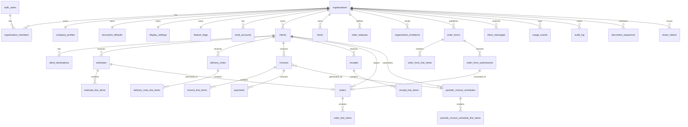

# SalesFlow 백엔드(Supabase) 사양서

> 본 문서는 `c:\project\salesflow`(Next.js 16 + React 19) 프론트엔드 프로토타입을 **Supabase 백엔드에 즉시 적용**하기 위한 단일 사양서입니다. 한국어로 작성되었으며, 모든 SQL/코드 예시는 그대로 마이그레이션·구현 출발점으로 사용할 수 있습니다.

- 대상 리비전: 2026-05-26 시점 `src/` 전체
- Supabase: 로컬 CLI 설정만 존재(`supabase/config.toml`), 마이그레이션·런타임 코드 없음
- 통화: **JPY 단일** (정수 엔)
- 다국어: UI만 (ja/ko/en) — DB 저장 데이터는 사용자 입력 그대로

---

## 목차

1. [개요 & 목표](#1-개요--목표)
2. [테넌시 모델 — 하이브리드](#2-테넌시-모델--하이브리드)
3. [인증 & 세션](#3-인증--세션)
4. [데이터 모델](#4-데이터-모델)
5. [Enum 카탈로그](#5-enum-카탈로그)
6. [ER 다이어그램](#6-er-다이어그램)
7. [RLS 정책 전략](#7-rls-정책-전략)
8. [Storage 버킷](#8-storage-버킷)
9. [번호 채번 & 시퀀스](#9-번호-채번--시퀀스)
10. [세금/금액 계산 규칙](#10-세금금액-계산-규칙)
11. [소프트 삭제 & 휴지통](#11-소프트-삭제--휴지통)
12. [Server Actions / Data Access 레이어](#12-server-actions--data-access-레이어)
13. [마이그레이션 파일 구성](#13-마이그레이션-파일-구성)
14. [프론트 통합 단계별 로드맵 (Phase 0–5)](#14-프론트-통합-단계별-로드맵-phase-05)
15. [부록](#15-부록)

---

## 1. 개요 & 목표

### 1.1 현재 상태 (Before)

- 데이터: `src/app/[lang]/**/content.ts`의 정적 mock + `localStorage`
- 인증: 없음. `src/proxy.ts`는 i18n rewrite만 수행
- 영속화 키 (localStorage 9종): `salesflow:companyProfile`, `salesflow-lang`, `*-line-items` draft들
- Supabase: 패키지 설치(`@supabase/ssr`, `@supabase/supabase-js`)만 완료. 런타임 사용처 0건
- 페이지: `/[lang]` 하위 약 40개 라우트, 대부분 Client Component

### 1.2 목표 (After)

| 영역 | 목표 |
|---|---|
| DB | PostgreSQL 17, 멀티테넌트 스키마, RLS 강제, 채번/합계 RPC |
| Auth | Supabase Auth (이메일/비밀번호, 향후 OAuth 확장) + 가입 시 1인 org 자동 생성 |
| Storage | 회사 로고/인영, 문서 첨부, CSV 임시 업로드 — 모두 org-scoped path + RLS |
| 데이터 접근 | RSC에서 read, Server Action에서 write. 클라이언트 직접 fetch 금지 |
| i18n | URL `[lang]` 유지, locale 쿠키 `salesflow-lang` 유지 |

### 1.3 핵심 결정 요약

| 결정 | 선택 | 근거 |
|---|---|---|
| 테넌시 | **하이브리드** (org 도입 + 가입 시 1인 org 자동생성) | 지금은 단일 사용자처럼 동작하지만 팀 기능(`settings/team`) UI가 이미 존재. 후일 확장 비용 0 |
| 문서 테이블 구성 | **타입별 분리** (`estimates`, `invoices`, `receipts`, `delivery_notes`) | 필드/번호 규칙/RLS 차이 크고 쿼리 단순. 공통 패턴은 컬럼 네이밍으로 통일 |
| 라인 아이템 | **스냅샷** (`tax_rate_snapshot`, `unit_price_snapshot`, `name_snapshot`) | 마스터(`items`) 변경 시 과거 문서 변형 방지 |
| 통화 | **JPY 정수 엔** | UI가 `ja-JP` 고정, 소수 없음. `bigint` 사용해 오버플로 방지 |
| 세금 라운딩 | 라인 단위 `FLOOR()` (현 프론트 일치), 문서 옵션은 표시 처리 | `documents/new-document-shared.tsx`의 `Math.floor` 정책과 일치 |
| 데이터 접근 패턴 | **Server Actions + RSC** | 현재 거의 100% client component인 것을 RSC 우선으로 리팩토링 |
| 채번 | RPC `next_document_number()` + advisory lock | 동시성 안전, org/타입/일자 조합 단조증가 |

### 1.4 비범위 (Out of Scope)

- 결제 처리 (Stripe / GMO Payment Plus 실 결제 흐름)
- 외부 회계 연동 (yayoi/freee/Smart Evidence)
- 모바일 푸시
- DB 컬럼 자체의 다국어 (i18n은 UI 레이어에서만)
- 적격청구서 발행사업자 정보 외부 API 검증

---

## 2. 테넌시 모델 — 하이브리드

### 2.1 개념

- 모든 비즈니스 데이터는 `organization_id`에 종속
- 사용자(`auth.users`)는 `organization_members`를 통해 **여러 org에 속할 수 있음**
- **신규 가입 시**: `handle_new_user()` 트리거가 자동으로 1인 org 생성 + `owner` 멤버십 등록
- 사용자 입장에서 지금은 "1인 → 1 org"처럼 보이지만, 팀 초대 흐름(`settings/team`)을 그대로 활성화 가능

### 2.2 역할(role)

| role | 권한 (요약) |
|---|---|
| `owner` | 모든 권한 + org 삭제, 결제 정보 변경, 소유권 이전 |
| `admin` | 모든 비즈니스 데이터 CRUD + 멤버 초대/제거 |
| `member` | 비즈니스 데이터 CRUD, 멤버 관리 불가, 회사 정보 수정 불가 |
| `viewer` (예약) | 읽기 전용 (향후) |

### 2.3 트리거: 가입 시 1인 org 자동 생성

```sql
-- 0002_organizations_and_auth.sql 발췌
create or replace function public.handle_new_user()
returns trigger
language plpgsql
security definer set search_path = public
as $$
declare
  new_org_id uuid;
begin
  insert into public.profiles (id, email, display_name)
  values (new.id, new.email, coalesce(new.raw_user_meta_data->>'display_name', new.email));

  insert into public.organizations (name, plan)
  values (coalesce(new.raw_user_meta_data->>'org_name', 'My Workspace'), 'free_trial')
  returning id into new_org_id;

  insert into public.organization_members (organization_id, user_id, role)
  values (new_org_id, new.id, 'owner');

  insert into public.company_profiles (organization_id) values (new_org_id);
  insert into public.document_defaults (organization_id) values (new_org_id);
  insert into public.display_settings (organization_id) values (new_org_id);

  return new;
end;
$$;

create trigger on_auth_user_created
  after insert on auth.users
  for each row execute procedure public.handle_new_user();
```

### 2.4 활성 org 선택

- 클라이언트 쿠키 `salesflow-active-org` (uuid, 없으면 첫 멤버십 org 사용)
- Server에서 `getActiveOrganization()` 헬퍼가 멤버십 검증 후 반환
- RLS는 `auth_org_ids()`(아래)로 멤버십 보유 org **전체**를 허용. 활성 org 선택은 애플리케이션 레이어 책임

---

## 3. 인증 & 세션

### 3.1 Supabase Auth 설정

`supabase/config.toml` 권장 변경 사항:

| 항목 | 현재 | 권장 |
|---|---|---|
| `enable_signup` | true | true |
| `enable_confirmations` | false | **true** (inbox/order-form/evidence가 이메일 인증을 전제로 함) |
| `site_url` | `http://127.0.0.1:3000` | 환경별 분리 (`.env`로 주입) |
| `jwt_expiry` | 3600 | 3600 유지, refresh rotation ON |
| OAuth | 비활성 | Phase 1 이후 Google 활성화 옵션 |

### 3.2 인증 라우트

i18n prefix(`/[lang]/...`) 하위에 추가:

| 경로 | 컴포넌트 | 설명 |
|---|---|---|
| `/[lang]/auth/sign-in/page.tsx` | RSC + Form Action | 이메일/비밀번호 로그인 |
| `/[lang]/auth/sign-up/page.tsx` | RSC + Form Action | 가입 (이메일 인증 메일 발송) |
| `/[lang]/auth/forgot-password/page.tsx` | RSC + Form Action | 비밀번호 재설정 메일 |
| `/[lang]/auth/reset-password/page.tsx` | Client | 토큰 수신 후 새 비밀번호 |
| `/auth/callback/route.ts` | Route Handler | OAuth/매직링크 콜백 (locale 무관) |
| `/auth/sign-out/route.ts` | Route Handler (POST) | 세션 종료 후 `/[lang]/auth/sign-in` 리다이렉트 |

### 3.3 보호 라우트

- 보호 대상: `/[lang]/(dashboard)/**` — 모든 비즈니스 페이지
- 예외(공개): `/[lang]/auth/**`, `/[lang]/order-forms/[token]/**` (공개 발주폼), `/[lang]/share/[type]/[token]/**` (공유 링크)

### 3.4 `src/proxy.ts` 확장

현재 i18n rewrite만 수행. 다음 책임을 추가:

```ts
// src/proxy.ts (의사 코드)
import { updateSession } from "@/lib/supabase/middleware";

export async function proxy(request: NextRequest) {
  const localePass = await applyLocaleRewrite(request); // 기존 로직
  if (localePass.shouldExit) return localePass.response;

  const sessionResponse = await updateSession(request, localePass.response);

  if (isProtectedPath(request.nextUrl.pathname)) {
    const user = await getUserFromCookies(request);
    if (!user) {
      const url = request.nextUrl.clone();
      url.pathname = `/${localePass.locale}/auth/sign-in`;
      return NextResponse.redirect(url);
    }
  }
  return sessionResponse;
}
```

매처는 기존(`/((?!api|_next/static|_next/image|favicon.ico|sitemap.xml|robots.txt).*)`) 유지. Supabase 쿠키(`sb-*`) refresh가 자동으로 매 요청마다 발생.

### 3.5 Supabase 클라이언트 헬퍼

```
src/lib/supabase/
  client.ts        // 'use client' — createBrowserClient
  server.ts        // RSC/Server Action — createServerClient (next/cookies 사용)
  middleware.ts    // proxy.ts에서 사용 — createServerClient (NextRequest cookies)
  database.types.ts // gen types로 자동 생성, 커밋
```

`server.ts` 골격:

```ts
import { createServerClient } from "@supabase/ssr";
import { cookies } from "next/headers";
import type { Database } from "./database.types";

export async function getSupabaseServerClient() {
  const cookieStore = await cookies();
  return createServerClient<Database>(
    process.env.NEXT_PUBLIC_SUPABASE_URL!,
    process.env.NEXT_PUBLIC_SUPABASE_ANON_KEY!,
    {
      cookies: {
        getAll: () => cookieStore.getAll(),
        setAll: (list) => list.forEach((c) => cookieStore.set(c.name, c.value, c.options)),
      },
    },
  );
}
```

---

## 4. 데이터 모델

> 모든 테이블은 명시되지 않아도 `id uuid pk default gen_random_uuid()`, `created_at timestamptz not null default now()`, `updated_at timestamptz not null default now()`를 가집니다. `updated_at`는 공통 트리거로 자동 갱신.

### 4.1 코어: 조직·사용자

#### `organizations`

| 컬럼 | 타입 | 제약 | 설명 |
|---|---|---|---|
| `id` | uuid | pk | |
| `name` | text | not null | 워크스페이스 표시명 |
| `slug` | citext | unique | URL/검색 용 (선택) |
| `plan` | `plan_tier` | not null default `'free_trial'` | |
| `service_contract_id` | text | unique | 외부 서비스 식별 (`settings/account`) |
| `yayoi_linked` | boolean | not null default false | |
| `deleted_at` | timestamptz | | |

#### `profiles` (1:1 with `auth.users`)

| 컬럼 | 타입 | 제약 |
|---|---|---|
| `id` | uuid | pk, fk → `auth.users(id)` on delete cascade |
| `email` | citext | not null |
| `display_name` | text | |
| `avatar_url` | text | |
| `locale` | text | default `'ja'` |

#### `organization_members`

| 컬럼 | 타입 | 제약 |
|---|---|---|
| `organization_id` | uuid | fk → organizations |
| `user_id` | uuid | fk → auth.users |
| `role` | `member_role` | not null |
| `invited_by` | uuid | fk → auth.users null |
| `joined_at` | timestamptz | |
| pk | (organization_id, user_id) | |

#### `organization_invitations`

| 컬럼 | 타입 | 설명 |
|---|---|---|
| `id` | uuid | pk |
| `organization_id` | uuid | fk |
| `email` | citext | not null |
| `role` | `member_role` | not null default `'member'` |
| `token` | text | unique, 100자 무작위 |
| `expires_at` | timestamptz | |
| `accepted_at` | timestamptz | null |
| `invited_by` | uuid | fk → auth.users |

### 4.2 회사 설정 (org당 1행)

#### `company_profiles`

`src/lib/company-profile.ts` + `settings/company/page.tsx` 기반.

| 컬럼 | 타입 | 비고 |
|---|---|---|
| `organization_id` | uuid | pk, fk → organizations |
| `postal_code` | text | `000-0000` |
| `address_line1`/`2`/`3` | text | 3행 |
| `company_name_line1`/`2`/`3` | text | line1 필수(완성 조건) |
| `tel`, `fax`, `email` | text | |
| `invoice_registration_number` | text | `T` + 13자리 (적격청구서) |
| `logo_path` | text | Storage `org-logos/{org}/logo.{ext}` |
| `seal_path` | text | Storage `org-seals/{org}/seal.{ext}` |
| `representative_name` | text | (선택) |

완료 판정 함수: `is_company_profile_complete(organization_id)` → `(postal_code IS NOT NULL AND address_line1 IS NOT NULL AND company_name_line1 IS NOT NULL)`.

#### `document_defaults`

`settings/document-defaults/page.tsx` 기반.

| 컬럼 | 타입 | 기본값 |
|---|---|---|
| `organization_id` | uuid | pk |
| `numbering_rule` | text | `'{Y}{M}{D}-{連番:M,3}'` |
| `line_item_label_name`/`_qty`/`_price`/`_amount` | text | 일본어 기본값 |
| `estimate_heading` | text | `'見積書'` |
| `estimate_message`, `estimate_remarks` | text | |
| `delivery_note_message`, `delivery_note_remarks` | text | |
| `invoice_message`, `invoice_remarks` | text | |
| `receipt_message`, `receipt_remarks` | text | |
| `estimate_template_key` | text | `'standard'` |
| `delivery_note_template_key` | text | `'standard'` |
| `invoice_template_key` | text | `'standard'` |
| `receipt_template_key` | text | `'standard'` |
| `category_format_always_print` | boolean | invoice용 |
| `tax_display_default` | `tax_display_mode` | `'separate'` |
| `tax_rounding_default` | `tax_rounding` | `'round_down'` |
| `withholding_default` | `withholding_type` | `'none'` |

#### `display_settings`

| 컬럼 | 타입 | 기본값 |
|---|---|---|
| `organization_id` | uuid | pk |
| `list_page_size` | smallint | 30 (check in 30/50/100) |
| `home_page_after_login` | text | `'home'` |

#### `feature_flags` (org당 1행, JSONB 한 컬럼)

| 컬럼 | 타입 | 기본값 |
|---|---|---|
| `organization_id` | uuid | pk |
| `flags` | jsonb | `{ "mailingStatusEmail": true, "hideSalesflowLogo": false, "purchaseOrderPdf": false, "itemManagement": true, "orderButtonOnEstimate": true, "deliveryDatePerLineItem": false, "hideInvoiceCardPayment": false, "calendarSync": false }` |

#### `bank_accounts`

`settings/payment/page.tsx` + 청구서 양식 기반. **org당 최대 3**(체크 트리거).

| 컬럼 | 타입 |
|---|---|
| `id` | uuid pk |
| `organization_id` | uuid fk |
| `display_order` | smallint (1..3) |
| `bank_name` | text |
| `branch_name` | text |
| `account_type` | text (`'futsu' | 'touza' | 'chochiku'`) |
| `account_number` | text |
| `account_holder` | text |

### 4.3 마스터: 거래처·품목

#### `clients`

`src/app/[lang]/clients/content.ts` + `client-registration-modal.tsx` 기반.

| 컬럼 | 타입 | 제약 |
|---|---|---|
| `id` | uuid | pk |
| `organization_id` | uuid | fk |
| `name` | text | not null, max 40 (check) |
| `furigana` | text | |
| `corp_number` | text | 일본 법인번호 |
| `management_code` | text | unique (organization_id, management_code) where not null — CSV 청구 연동 키 |
| `department` | text | (3행 textarea 한 컬럼) |
| `email` | text | |
| `email_cc` | text[] | 쉼표 분리 → 배열 |
| `phone`, `fax` | text | |
| `honorific` | text | `'様' | '御中'` |
| `memo` | text | 문서 미인쇄 |
| `is_favorite` | boolean | default false |
| `deleted_at` | timestamptz | |

#### `client_destinations` (거래처당 N)

| 컬럼 | 타입 |
|---|---|
| `id` | uuid pk |
| `client_id` | uuid fk |
| `label` | text (탭 표시명) |
| `postal_code` | text |
| `address_line1`, `address_line2` | text |
| `mailing_line1`..`mailing_line4` | text (우편 발송용) |
| `email`, `email_cc` (text[]) | |
| `honorific` | text |
| `is_default` | boolean |

#### `items`

`src/app/[lang]/items/new/page.tsx` + CSV 일괄등록 기반.

| 컬럼 | 타입 | 제약 |
|---|---|---|
| `id` | uuid | pk |
| `organization_id` | uuid | fk |
| `name` | text | not null, max 255 |
| `unit` | text | max 255 |
| `unit_price` | bigint | not null default 0 (엔) |
| `tax_category` | `tax_category` | not null default `'follow_company'` |
| `withholding_exempt` | boolean | not null default false |
| `tax_exempt_flag` | boolean | (CSV `taxExemptFlag` 호환) |
| `deleted_at` | timestamptz | |

### 4.4 문서 패밀리

문서 타입별로 **분리**합니다 (`estimates`, `delivery_notes`, `invoices`, `receipts`). 공통 패턴(헤더/라인/스냅샷)은 컬럼 네이밍으로 통일.

#### 공통 헤더 컬럼 (모든 문서 테이블에 존재)

| 컬럼 | 타입 | 비고 |
|---|---|---|
| `id` | uuid pk | |
| `organization_id` | uuid fk | |
| `client_id` | uuid fk (null) | 거래처 (snapshot으로도 보존) |
| `client_destination_id` | uuid fk (null) | |
| `document_number` | text not null | 채번 RPC 결과 |
| `subject` | text | max 70 |
| `issue_date` | date not null | |
| `status` | `document_status` | not null default `'draft'` |
| `internal_memo` | text | 비공개 |
| `recipient_snapshot` | jsonb | 거래처 정보 스냅샷 (name/postal/address/honorific 등) |
| `sender_snapshot` | jsonb | 회사 정보 스냅샷 (line1~3/주소/등록번호/로고경로 등) |
| `tax_display` | `tax_display_mode` | not null |
| `tax_rounding` | `tax_rounding` | not null |
| `withholding_type` | `withholding_type` | not null default `'none'` |
| `template_key` | text | |
| `template_message` | text | |
| `remarks` | text | |
| `subtotal` | bigint | 합계 RPC가 갱신 |
| `tax_amount` | bigint | |
| `total` | bigint | generated `(subtotal + tax_amount)` stored |
| `created_by` | uuid fk auth.users | |
| `deleted_at` | timestamptz | |
| `share_token` | text unique | null이면 미공유 (Phase 4) |

#### `estimates` (견적서)

추가 컬럼:

| 컬럼 | 타입 | 비고 |
|---|---|---|
| `expiry_date` | date null | |
| `ordered_at` | timestamptz null | "수주됨" 처리 시 |
| `ordered_order_id` | uuid fk orders null | |

#### `delivery_notes`

| 컬럼 | 타입 |
|---|---|
| `delivery_date` | date null |
| `linked_invoice_id` | uuid fk invoices null |

#### `invoices`

| 컬럼 | 타입 | 비고 |
|---|---|---|
| `payment_due` | date null | |
| `delivery_date` | date null | |
| `billing_month` | text null | 표시용 (`'2026年5月'`) |
| `payment_option` | `payment_option` | default `'none'` |
| `bank_account_ids` | uuid[] | 인쇄 시 표시할 계좌 (최대 3) |
| `card_payment_enabled` | boolean | |
| `card_qr_print` | boolean | |
| `gmo_pg_member_id` | text | |
| `category_format_always_print` | boolean | |
| `paid_amount` | bigint default 0 | `payments` 합산 |
| `paid_at` | timestamptz null | |
| `periodic_schedule_id` | uuid fk null | 정기청구로 생성된 경우 |

#### `receipts`

| 컬럼 | 타입 | 비고 |
|---|---|---|
| `transaction_date` | date null | 거래일 (발행일과 별도) |
| `linked_invoice_id` | uuid fk invoices null | |

#### `*_line_items` (4개 테이블, 동일 구조)

`estimate_line_items`, `delivery_note_line_items`, `invoice_line_items`, `receipt_line_items`

| 컬럼 | 타입 | 비고 |
|---|---|---|
| `id` | uuid pk | |
| `document_id` | uuid fk (해당 문서) | on delete cascade |
| `line_no` | smallint not null | 1..80 |
| `item_id` | uuid fk items null | 마스터 참조 (옵션) |
| `name_snapshot` | text not null | |
| `qty` | numeric(18,4) not null default 1 | 자유 문자 입력은 파싱 후 저장 |
| `unit_snapshot` | text | |
| `unit_price_snapshot` | bigint not null | |
| `tax_category` | `tax_category` not null | |
| `tax_rate_snapshot` | numeric(5,4) not null | 0.10, 0.08 등 |
| `withholding_exempt_snapshot` | boolean | |
| `line_subtotal` | bigint generated `(qty * unit_price_snapshot)` stored | |
| unique | (document_id, line_no) | |

#### `payments` (수금 — 리포트용)

| 컬럼 | 타입 |
|---|---|
| `id` | uuid pk |
| `organization_id` | uuid fk |
| `invoice_id` | uuid fk invoices |
| `client_id` | uuid fk clients (denormalize for report) |
| `paid_at` | date not null |
| `amount` | bigint not null |
| `method` | text (`'bank' | 'card' | 'cash' | 'other'`) |
| `memo` | text |

### 4.5 정기 청구

#### `periodic_invoice_schedules`

| 컬럼 | 타입 | 비고 |
|---|---|---|
| `id` | uuid pk | |
| `organization_id` | uuid fk | |
| `client_id` | uuid fk clients | |
| `subject` | text | max 70 |
| `start_date` | date not null | |
| `cycle` | `periodic_cycle` | `'monthly' | 'yearly' | 'weekly'` |
| `day_mode` | text | `'day' | 'last'` |
| `day_value` | smallint | 1..28 |
| `end_mode` | text | `'none' | 'date'` |
| `end_date` | date null | |
| `payment_mode` | text | `'none' | 'due'` |
| `payment_month` | text | `'current' | 'next'` |
| `payment_day` | smallint | 1..28 |
| `email_enabled` | boolean | |
| `email_subject`, `email_body` | text | |
| `tax_display`, `tax_rounding`, `withholding_type` | enums | invoice와 동일 |
| `template_key` | text | |
| `last_generated_at` | timestamptz null | |
| `next_run_at` | timestamptz null | cron 스케줄링 |
| `is_paused` | boolean default false | |
| `deleted_at` | timestamptz | |

#### `periodic_invoice_schedule_line_items`

`*_line_items`와 동일 구조 + `name_template` / `unit_price` 컬럼은 `{month}`, `{year}` 변수 보존 (`name_snapshot`에 치환 전 원본 저장).

### 4.6 수주 (Orders)

#### `order_statuses` (org별 커스텀)

| 컬럼 | 타입 | 비고 |
|---|---|---|
| `id` | uuid pk | |
| `organization_id` | uuid fk | |
| `name` | text not null | |
| `display_order` | smallint | |
| `is_system` | boolean | `unprocessed`, `processed`, `trash`는 system (unique) |
| `system_key` | `order_system_status` null | unique (org, system_key) |
| `color` | text | (선택) |

기본 row 3개를 트리거 또는 `handle_new_user()`에서 생성.

#### `orders`

| 컬럼 | 타입 | 비고 |
|---|---|---|
| `id` | uuid pk | |
| `organization_id` | uuid fk | |
| `client_id` | uuid fk clients null | |
| `order_number` | text not null | 채번 |
| `order_date` | date not null | |
| `delivery_date` | date null | |
| `order_time` | time null | |
| `subject` | text | |
| `status_id` | uuid fk order_statuses | |
| `comment` | text | |
| `source_estimate_id` | uuid fk estimates null | "견적에서 수주" |
| `source_order_form_submission_id` | uuid fk null | 온라인 폼 제출에서 생성 |
| `subtotal`, `tax_amount`, `total` | bigint | |
| `deleted_at` | timestamptz | |

#### `order_line_items`

`*_line_items` 동일 구조 (FK `order_id`).

### 4.7 온라인 발주폼 (Order Forms)

#### `order_forms`

| 컬럼 | 타입 | 비고 |
|---|---|---|
| `id` | uuid pk | |
| `organization_id` | uuid fk | |
| `name` | text | 내부 식별 |
| `client_name_required` | boolean default true | |
| `subject` | text | max 70 |
| `logo_path` | text | (회사 로고 별도 지정 시) |
| `expiration_mode` | text | `'date' | 'none'` |
| `expiration_date` | date null | |
| `public_token` | text unique not null | 공개 URL용 |
| `is_published` | boolean default true | |
| `deleted_at` | timestamptz | |

전제: `is_company_profile_complete(org)` AND owner의 `auth.users.email_confirmed_at IS NOT NULL` → Server Action에서 검증.

#### `order_form_line_items`

`*_line_items`와 유사하되 **`qty` 없음**(고객 입력) + `tax_category`, `unit_price_snapshot`, `name_snapshot`, `unit_snapshot`.

#### `order_form_submissions`

| 컬럼 | 타입 | 비고 |
|---|---|---|
| `id` | uuid pk | |
| `order_form_id` | uuid fk | |
| `organization_id` | uuid fk | (RLS 단순화 위한 denormalize) |
| `client_name_input` | text | |
| `email_input` | text | |
| `phone_input` | text | |
| `payload` | jsonb | 원본 응답 (라인별 qty 등) |
| `submitted_at` | timestamptz default now() | |
| `converted_order_id` | uuid fk orders null | |

### 4.8 메시지·이용·감사

#### `inbox_messages`

| 컬럼 | 타입 | 비고 |
|---|---|---|
| `id` | uuid pk | |
| `organization_id` | uuid fk | |
| `kind` | text | `'received_document' | 'system' | 'announcement'` |
| `subject` | text | |
| `body` | text | |
| `payload` | jsonb | 첨부/링크 메타 |
| `read_at` | timestamptz null | |
| `created_at` | timestamptz | |

#### `notifications` (브라우저/이메일용 분리)

inbox보다 단발성. 토스트/배지 트리거용. 동일한 org-scoped 구조.

#### `usage_events`

`usage/page.tsx` 기반.

| 컬럼 | 타입 | 비고 |
|---|---|---|
| `id` | uuid pk | |
| `organization_id` | uuid fk | |
| `event_date` | date not null | |
| `kind` | text | `'mail' | 'fax' | 'collection_guarantee' | 'invoice_created' | 'pdf_download' | ...` |
| `count` | int default 1 | |
| `amount_jpy` | bigint default 0 | 청구 금액 |
| `reference_table` | text | (선택) `'invoices'` 등 |
| `reference_id` | uuid | (선택) |

#### `audit_log`

| 컬럼 | 타입 |
|---|---|
| `id` | bigint pk identity |
| `organization_id` | uuid |
| `actor_user_id` | uuid |
| `table_name` | text |
| `row_id` | uuid |
| `action` | text (`'insert' | 'update' | 'delete' | 'soft_delete' | 'restore' | 'issue' | 'share'`) |
| `before` | jsonb |
| `after` | jsonb |
| `created_at` | timestamptz default now() |

### 4.9 채번 / 시퀀스 상태

#### `document_sequences`

| 컬럼 | 타입 | 비고 |
|---|---|---|
| `organization_id` | uuid | pk part |
| `doc_type` | text | pk part: `'estimate' | 'delivery_note' | 'invoice' | 'receipt' | 'order'` |
| `date_key` | text | pk part: 패턴별 키 (`'20260522'` 등) |
| `last_seq` | int not null default 0 | |
| pk | (organization_id, doc_type, date_key) | |

### 4.10 공유 토큰 / 공개 링크

#### `share_tokens`

| 컬럼 | 타입 | 비고 |
|---|---|---|
| `token` | text pk | 32~64자 무작위 |
| `organization_id` | uuid fk | |
| `target_table` | text | `'estimates' | 'invoices' | 'receipts' | 'delivery_notes'` |
| `target_id` | uuid | |
| `created_by` | uuid fk auth.users | |
| `expires_at` | timestamptz null | |
| `revoked_at` | timestamptz null | |

조회 RPC `get_shared_document(token text)`는 `security definer`로 RLS 우회하여 해당 row만 반환.

---

## 5. Enum 카탈로그

PostgreSQL `CREATE TYPE` 정의. 모든 enum은 마이그레이션 `0001_extensions_and_helpers.sql` 또는 도입 시점 마이그레이션에 선언.

```sql
create type tax_category as enum (
  'follow_company', 'standard_10', 'reduced_8', 'standard_8', 'exempt', 'standard_5'
);

create type tax_display_mode as enum (
  'separate', 'separate_on_invoice', 'included', 'exempt'
);

create type tax_rounding as enum (
  'round_down', 'round_up', 'round_half'
);

create type withholding_type as enum (
  'none', 'with_recovery', 'without_recovery'
);

create type document_status as enum (
  'draft', 'issued', 'sent', 'confirmed', 'overdue', 'trashed'
);

create type periodic_cycle as enum (
  'monthly', 'yearly', 'weekly'
);

create type payment_option as enum (
  'none', 'card_plus', 'deferred_plus'
);

create type order_system_status as enum (
  'unprocessed', 'processed', 'trash'
);

create type member_role as enum (
  'owner', 'admin', 'member', 'viewer'
);

create type plan_tier as enum (
  'free_trial', 'starter', 'standard', 'pro'
);
```

### Enum ↔ 프론트 값 매핑

| Enum | 프론트 표현 (`content.ts`/UI) |
|---|---|
| `tax_category.standard_10` | `'10%'` |
| `tax_category.reduced_8` | `'軽減8%'` / `'reduced8'` / CSV `'R8'` |
| `tax_category.standard_8` | `'8%'` / CSV `'8'` |
| `tax_category.standard_5` | `'5%'` |
| `tax_category.exempt` | `'対象外'` / `'exempt'` |
| `tax_display_mode.separate` | `'税別表示'` |
| `tax_display_mode.separate_on_invoice` | `'税別表示（請求時に計算）'` |
| `tax_display_mode.included` | `'税込表示'` |
| `tax_display_mode.exempt` | `'税込表示（免税）'` |
| `tax_rounding.round_down` | `'切り捨て'` |
| `withholding_type.with_recovery` | `'復興税あり'` |
| `document_status.*` | 홈 화면 `下書き保存 / 送付済み / 発行 / 入金確認待ち / 期限超過` 매핑 |
| `payment_option.card_plus` | `'カード決済プラス'` |

---

## 6. ER 다이어그램



---

## 7. RLS 정책 전략

### 7.1 공통 헬퍼

```sql
-- 0001_extensions_and_helpers.sql
create or replace function public.auth_org_ids()
returns setof uuid
language sql stable
security definer set search_path = public
as $$
  select organization_id
  from public.organization_members
  where user_id = auth.uid();
$$;

create or replace function public.auth_has_role_in_org(_org uuid, _roles member_role[])
returns boolean
language sql stable
security definer set search_path = public
as $$
  select exists (
    select 1 from public.organization_members
    where organization_id = _org and user_id = auth.uid() and role = any(_roles)
  );
$$;
```

### 7.2 정책 패턴

| 패턴 | 사용 테이블 | 규칙 |
|---|---|---|
| **A. org-owned r/w** | 대부분의 비즈니스 테이블 | `select/insert/update/delete using (organization_id in (select auth_org_ids()))` |
| **B. owner/admin only write** | `organizations`, `company_profiles`, `document_defaults`, `bank_accounts`, `organization_members`, `feature_flags` | select=A, insert/update/delete=`auth_has_role_in_org(organization_id, array['owner','admin'])` |
| **C. self-row** | `profiles` | `using (id = auth.uid())` |
| **D. public via token** | `share_tokens` 경유 RPC만 노출, 테이블 자체는 service-role만 |
| **E. submissions (public insert)** | `order_form_submissions` | insert는 `true` (공개), select는 패턴 A |

### 7.3 테이블별 매트릭스 (요약)

| 테이블 | SELECT | INSERT | UPDATE | DELETE |
|---|---|---|---|---|
| `organizations` | A | service-role | B | service-role |
| `organization_members` | A | B | B | B |
| `profiles` | C OR (id in org members of caller) | C (자동) | C | none |
| `company_profiles`, `document_defaults`, `display_settings`, `feature_flags` | A | system trigger | B | none |
| `bank_accounts` | A | B | B | B |
| `clients`, `client_destinations`, `items` | A | A | A | A (soft via update `deleted_at`) |
| `estimates`, `delivery_notes`, `invoices`, `receipts` 및 각 `_line_items` | A | A | A | A (소프트 삭제 RPC 권장) |
| `orders`, `order_line_items`, `order_statuses` | A | A | A | A |
| `periodic_invoice_schedules`(+items) | A | A | A | A |
| `order_forms`(+items) | A | A | A | A |
| `order_form_submissions` | A | **anyone** (RLS `using (true)` for insert) | A | A |
| `payments` | A | A | A | A |
| `inbox_messages`, `notifications`, `usage_events` | A | system (service-role) | A (read mark) | A |
| `audit_log` | A | service-role | none | none |
| `document_sequences` | none(직접 노출 X) | service-role | service-role | none |
| `share_tokens` | none | A (created_by) | A | A |

### 7.4 공유 링크 RPC

```sql
create or replace function public.get_shared_estimate(_token text)
returns jsonb
language plpgsql stable
security definer set search_path = public
as $$
declare est_row jsonb;
begin
  select to_jsonb(e.*) into est_row
  from public.estimates e
  join public.share_tokens t on t.target_table = 'estimates' and t.target_id = e.id
  where t.token = _token
    and (t.expires_at is null or t.expires_at > now())
    and t.revoked_at is null
    and e.deleted_at is null;
  return est_row;
end;
$$;
grant execute on function public.get_shared_estimate(text) to anon;
```

(invoices/receipts/delivery_notes 동일 패턴)

### 7.5 공개 발주폼 RPC

```sql
create or replace function public.get_public_order_form(_token text)
returns jsonb
language sql stable
security definer set search_path = public
as $$
  select jsonb_build_object(
    'form', to_jsonb(f.*),
    'lines', coalesce(jsonb_agg(to_jsonb(li.*) order by li.line_no), '[]'::jsonb)
  )
  from public.order_forms f
  left join public.order_form_line_items li on li.order_form_id = f.id
  where f.public_token = _token
    and f.is_published = true
    and f.deleted_at is null
  group by f.id;
$$;
grant execute on function public.get_public_order_form(text) to anon;

create or replace function public.submit_public_order_form(
  _token text,
  _client_name text,
  _email text,
  _phone text,
  _payload jsonb
) returns uuid
language plpgsql security definer set search_path = public
as $$
declare _form public.order_forms; _sub_id uuid;
begin
  select * into _form from public.order_forms where public_token = _token and is_published = true;
  if _form is null then raise exception 'form_not_found'; end if;

  insert into public.order_form_submissions
    (order_form_id, organization_id, client_name_input, email_input, phone_input, payload)
  values (_form.id, _form.organization_id, _client_name, _email, _phone, _payload)
  returning id into _sub_id;

  return _sub_id;
end;
$$;
grant execute on function public.submit_public_order_form(text, text, text, text, jsonb) to anon;
```

---

## 8. Storage 버킷

### 8.1 버킷 목록

| 버킷 | 공개 | 크기 제한 | 허용 MIME | 경로 규칙 |
|---|---|---|---|---|
| `org-logos` | **public** | 1 MiB | image/png, image/jpeg, image/gif | `{organization_id}/logo-{uuid}.{ext}` |
| `org-seals` | private | 1 MiB | 동일 | `{organization_id}/seal-{uuid}.{ext}` |
| `document-assets` | private | 10 MiB | image/*, application/pdf | `{organization_id}/{doc_type}/{doc_id}/{uuid}.{ext}` |
| `csv-imports` | private | 5 MiB | text/csv, application/vnd.ms-excel | `{organization_id}/imports/{uuid}.csv` (24h TTL via cron) |
| `order-form-logos` | public | 1 MiB | image/* | `{organization_id}/forms/{form_id}.{ext}` |

### 8.2 Storage RLS (예시 — `org-seals`)

```sql
-- 0009_storage_buckets_policies.sql
insert into storage.buckets (id, name, public, file_size_limit, allowed_mime_types) values
  ('org-seals', 'org-seals', false, 1048576, array['image/png','image/jpeg','image/gif'])
on conflict (id) do nothing;

create policy "seals_read_own_org"
on storage.objects for select
to authenticated
using (
  bucket_id = 'org-seals'
  and (storage.foldername(name))[1]::uuid in (select auth_org_ids())
);

create policy "seals_insert_own_org"
on storage.objects for insert
to authenticated
with check (
  bucket_id = 'org-seals'
  and (storage.foldername(name))[1]::uuid in (select auth_org_ids())
);

create policy "seals_delete_own_org"
on storage.objects for delete
to authenticated
using (
  bucket_id = 'org-seals'
  and (storage.foldername(name))[1]::uuid in (select auth_org_ids())
);
```

`csv-imports`는 정리 cron(Edge Function or pg_cron)을 두어 24시간 경과 객체를 hard delete.

### 8.3 프론트 사용처 매핑

| 사용처 | 버킷 | 컴포넌트 |
|---|---|---|
| 회사 로고 | `org-logos` | `settings/company/page.tsx` (`name="companyLogo"`) |
| 회사 인영 | `org-seals` | `settings/company/page.tsx` (`name="companySeal"`) |
| 문서별 로고/인영 | `document-assets` | `documents/new-document-shared.tsx` |
| 품목 CSV | `csv-imports` | `items/bulk/page.tsx` |
| 청구서 CSV | `csv-imports` | `invoices/csv_upload/page.tsx` |
| 발주폼 로고 | `order-form-logos` | `orders/form/new/page.tsx` |

---

## 9. 번호 채번 & 시퀀스

### 9.1 패턴

- 기본 템플릿: `{Y}{M}{D}-{連番:M,3}` → `20260522-001`
- org별 `document_defaults.numbering_rule`로 커스터마이즈 (Phase 5에서 파서 확장)
- 토큰: `{Y}=YYYY`, `{YY}=YY`, `{M}=MM`, `{D}=DD`, `{連番:M,3}` = 월 단위 리셋·3자리 / `{連番:D,3}` = 일 단위 리셋·3자리
- 기본값은 일 단위 리셋(현 프론트 샘플 `20260522-001`, `20260522-002`와 일치)

### 9.2 RPC

```sql
-- 0010_rpc_and_triggers.sql 발췌
create or replace function public.next_document_number(
  _org uuid,
  _doc_type text,
  _issue_date date
) returns text
language plpgsql security definer set search_path = public
as $$
declare
  _rule text;
  _date_key text := to_char(_issue_date, 'YYYYMMDD');
  _seq int;
  _lock_key bigint;
begin
  -- 토큰 파서는 단순 일 단위로 시작, 확장은 Phase 5
  _lock_key := hashtextextended(_org::text || _doc_type || _date_key, 0);
  perform pg_advisory_xact_lock(_lock_key);

  insert into public.document_sequences (organization_id, doc_type, date_key, last_seq)
  values (_org, _doc_type, _date_key, 1)
  on conflict (organization_id, doc_type, date_key)
  do update set last_seq = public.document_sequences.last_seq + 1
  returning last_seq into _seq;

  return _date_key || '-' || lpad(_seq::text, 3, '0');
end;
$$;
```

서버 액션에서 호출 후 결과를 `document_number`로 INSERT.

---

## 10. 세금/금액 계산 규칙

### 10.1 단위

- 통화: JPY, 모든 금액 컬럼은 `bigint`(엔)
- 수량: `numeric(18,4)` (자유 입력 → 파싱)
- 세율: `numeric(5,4)` (예: `0.1000`, `0.0800`)

### 10.2 계산식 (프론트 `documents/new-document-shared.tsx` 일치)

```
line_subtotal = qty * unit_price_snapshot           -- generated column
taxable_by_rate[rate] = Σ line_subtotal where tax_rate_snapshot = rate
tax_by_rate[rate]     = FLOOR(taxable_by_rate[rate] * rate)
subtotal = Σ all line_subtotal
tax_amount = Σ tax_by_rate
total = subtotal + tax_amount    -- generated stored column
```

> `tax_display_mode`/`tax_rounding`는 **표시**용. 라인 단위 저장 값은 항상 위 식.

### 10.3 합계 갱신 RPC

```sql
create or replace function public.recalculate_invoice_totals(_doc_id uuid)
returns void language plpgsql as $$
declare _subtotal bigint; _tax bigint;
begin
  select coalesce(sum(line_subtotal),0) into _subtotal
  from public.invoice_line_items where document_id = _doc_id;

  select coalesce(sum(t), 0) into _tax from (
    select floor(sum(line_subtotal) * max(tax_rate_snapshot)) as t
    from public.invoice_line_items
    where document_id = _doc_id
    group by tax_rate_snapshot
  ) s;

  update public.invoices set subtotal = _subtotal, tax_amount = _tax where id = _doc_id;
end;
$$;
```

`*_line_items` insert/update/delete 트리거에서 자동 호출. (4개 문서 타입 각각)

---

## 11. 소프트 삭제 & 휴지통

### 11.1 규칙

- 모든 문서/마스터 테이블에 `deleted_at timestamptz null`
- 삭제 = `update set deleted_at = now()`
- 복구 = `update set deleted_at = null` (30일 이내)
- 30일 경과 시 cron이 hard delete

### 11.2 휴지통 뷰 (예: invoices)

```sql
create view public.invoices_trashed as
  select * from public.invoices
  where deleted_at is not null and deleted_at > now() - interval '30 days';
```

### 11.3 자동 정리 cron

```sql
-- pg_cron 사용 (Supabase에서 enable)
create extension if not exists pg_cron;

select cron.schedule(
  'purge_trashed_documents_daily',
  '0 3 * * *',
  $$
    delete from public.estimates       where deleted_at < now() - interval '30 days';
    delete from public.delivery_notes  where deleted_at < now() - interval '30 days';
    delete from public.invoices        where deleted_at < now() - interval '30 days';
    delete from public.receipts        where deleted_at < now() - interval '30 days';
    delete from public.orders          where deleted_at < now() - interval '30 days';
  $$
);
```

pg_cron 미사용 환경에서는 Supabase Edge Function + Cron 호출로 대체.

---

## 12. Server Actions / Data Access 레이어

### 12.1 디렉터리 구조

```
src/lib/
  supabase/
    client.ts         # 'use client' 전용
    server.ts         # RSC/Server Action 전용
    middleware.ts     # proxy.ts 전용
    database.types.ts # 자동 생성 (커밋)
  db/
    organizations.ts
    profiles.ts
    company.ts
    clients.ts
    items.ts
    bank-accounts.ts
    estimates.ts
    delivery-notes.ts
    invoices.ts
    receipts.ts
    orders.ts
    order-statuses.ts
    order-forms.ts
    periodic-invoices.ts
    payments.ts
    inbox.ts
    usage.ts
    reports.ts
    share.ts
    storage.ts
  validators/         # zod 스키마
    common.ts
    document.ts
    client.ts
    item.ts
    ...
```

### 12.2 패턴 규약

- **읽기**: RSC(페이지/레이아웃)에서 `getSupabaseServerClient()`로 직접 query. 캐시는 `next.dynamic = 'force-dynamic'` 기본
- **쓰기**: `"use server"` Server Action으로 한정. 반환 타입은 `{ ok: true; data: T } | { ok: false; error: string; fieldErrors?: Record<string,string> }`
- **검증**: 모든 Server Action 입력은 zod 파싱
- **revalidation**: 성공 시 `revalidatePath('/[lang]/<해당 리스트>', 'page')`
- **클라이언트 직접 fetch 금지** (예외: 자동완성 등 즉시 응답 필요한 read-only 쿼리만, `client.ts` 사용)

### 12.3 핵심 액션 카탈로그

| 모듈 | Action | 트리거 화면 |
|---|---|---|
| company | `saveCompanyProfile`, `uploadCompanyLogo`, `uploadCompanySeal` | `settings/company` |
| display | `updateDisplaySettings` | `settings/display` |
| team | `inviteMember`, `acceptInvitation`, `revokeInvitation`, `updateMemberRole`, `removeMember` | `settings/team` |
| bank | `createBankAccount`, `updateBankAccount`, `deleteBankAccount` | `settings/payment` |
| clients | `createClient`, `updateClient`, `deleteClient`(soft), `toggleFavorite`, `addDestination` | `clients`, modal |
| items | `createItem`, `updateItem`, `deleteItem`(soft), `bulkImportItemsFromCsv` | `items/*` |
| estimates | `createEstimate`, `updateEstimate`, `issueEstimate`, `shareEstimate`(returns token), `revokeShare`, `deleteEstimate`(soft), `convertToOrder` | `estimates/*` |
| delivery_notes | `createDeliveryNote`, `linkToInvoice`, ... | `delivery-notes/*` |
| invoices | `createInvoice`, `bulkImportInvoicesFromCsv`, `recordPayment`, `markPaid`, ... | `invoices/*` |
| receipts | `createReceipt`, `linkToInvoice`, ... | `receipts/*` |
| periodic | `createSchedule`, `pauseSchedule`, `runScheduleNow`(cron) | `invoices/periodic/*` |
| orders | `createOrder`, `updateOrderStatus`, `addCustomStatus`, `deleteOrder` | `orders/*` |
| order_forms | `createForm`, `publishForm`, `submitPublicForm`(public RPC) | `orders/form/*` |
| reports | `getReceivablesByMonth(year, month)`, `getCollectionsByMonth(...)` | `reports/*` |
| inbox | `markRead`, `markAllRead` | `inbox` |
| usage | (read only) | `usage` |

### 12.4 검증 예 — `createEstimate`

```ts
// src/lib/validators/document.ts
export const lineItemSchema = z.object({
  itemId: z.string().uuid().optional(),
  name: z.string().min(1).max(255),
  qty: z.coerce.number().nonnegative(),
  unit: z.string().max(255).optional(),
  unitPrice: z.coerce.number().int().nonnegative(),
  taxCategory: z.enum(['follow_company','standard_10','reduced_8','standard_8','exempt','standard_5']),
});

export const createEstimateSchema = z.object({
  clientId: z.string().uuid().nullable(),
  subject: z.string().max(70).optional(),
  issueDate: z.coerce.date(),
  expiryDate: z.coerce.date().nullable(),
  taxDisplay: z.enum(['separate','separate_on_invoice','included','exempt']),
  taxRounding: z.enum(['round_down','round_up','round_half']),
  withholdingType: z.enum(['none','with_recovery','without_recovery']),
  templateKey: z.string().default('standard'),
  templateMessage: z.string().optional(),
  remarks: z.string().optional(),
  internalMemo: z.string().optional(),
  lineItems: z.array(lineItemSchema).min(1).max(80),
});
```

---

## 13. 마이그레이션 파일 구성

`supabase/migrations/` (모두 신규):

| 파일 | 내용 |
|---|---|
| `0001_extensions_and_helpers.sql` | `citext`, `pgcrypto`, `pg_cron`(가능 시), enum 전체, `auth_org_ids()`, `auth_has_role_in_org()`, `updated_at` 공통 트리거 함수 |
| `0002_organizations_and_auth.sql` | `organizations`, `profiles`, `organization_members`, `organization_invitations`, `handle_new_user()` + `on_auth_user_created` |
| `0003_company_and_defaults.sql` | `company_profiles`, `document_defaults`, `display_settings`, `feature_flags`, `bank_accounts` |
| `0004_clients_and_items.sql` | `clients`, `client_destinations`, `items` |
| `0005_documents_core.sql` | `estimates`, `delivery_notes`, `invoices`, `receipts` + 4개 `_line_items` + 합계 트리거 |
| `0006_orders_and_order_forms.sql` | `order_statuses`(+default seed trigger), `orders`, `order_line_items`, `order_forms`, `order_form_line_items`, `order_form_submissions` |
| `0007_periodic_invoices.sql` | `periodic_invoice_schedules`, `periodic_invoice_schedule_line_items`, `payments` |
| `0008_inbox_usage_audit.sql` | `inbox_messages`, `notifications`, `usage_events`, `audit_log`, `document_sequences`, `share_tokens` |
| `0009_storage_buckets_policies.sql` | 5개 버킷 등록 + Storage RLS |
| `0010_rpc_and_triggers.sql` | `next_document_number`, `recalculate_*_totals`, share/order_form public RPC, soft-delete helpers, pg_cron purge |
| `0011_rls_policies.sql` | 모든 테이블 `enable row level security` + 본문 7.3 매트릭스 정책 |

### 13.1 Seed (`supabase/seed.sql`)

- 데모 org `Studio Hikari` 1건
- 데모 owner 1명 (테스트 이메일, `auth.users`는 Supabase CLI로 별도 생성)
- 거래처 2건 (`'11111'`, `'raon2'`) — 현 mock과 동일
- 품목 3건 — 현 `home-content.ts` quick item 예시 사용
- 견적 1건 + 청구 1건 (Status `issued`, 금액 `131,800 / 13,180 / 144,980`)

### 13.2 타입 생성 워크플로

```powershell
# 로컬 DB 기동
supabase start

# 마이그레이션 적용
supabase db reset

# 타입 생성 (커밋)
supabase gen types typescript --local --schema public > src/lib/supabase/database.types.ts
```

CI에 `supabase db lint` 추가 권장.

---

## 14. 프론트 통합 단계별 로드맵 (Phase 0–5)

각 Phase는 **독립 배포 가능**해야 하며, Phase 완료 기준이 충족되어야 다음으로 진행.

### Phase 0 — 인프라 (1~2일)

| 작업 | 파일 |
|---|---|
| Supabase 클라이언트 헬퍼 3종 | `src/lib/supabase/{client,server,middleware}.ts` |
| 환경 변수 템플릿 | `.env.local.example` |
| `src/proxy.ts` 세션 refresh 결합 | `src/proxy.ts` |
| Auth 라우트 4종 | `src/app/[lang]/auth/{sign-in,sign-up,forgot-password,reset-password}/page.tsx`, `src/app/auth/callback/route.ts`, `src/app/auth/sign-out/route.ts` |
| 첫 마이그레이션 적용 (`0001`~`0002`) | `supabase/migrations/` |
| 타입 생성 | `src/lib/supabase/database.types.ts` |
| 보호 라우트 wrapper | `src/app/[lang]/(dashboard)/layout.tsx` 추가 (현 `[lang]/layout.tsx` 분리) |

**완료 기준**: 가입 → 자동 1인 org 생성 → 로그인 → `/[lang]` 진입, 로그아웃 동작.

### Phase 1 — 설정 (2~3일)

| 화면 | 파일 | DB |
|---|---|---|
| `settings/company` | `src/app/[lang]/settings/company/page.tsx` + `actions.ts` | `company_profiles`, Storage `org-logos`/`org-seals` |
| `settings/account` | `settings/account/page.tsx` | `organizations`, `profiles` |
| `settings/display` | `settings/display/page.tsx` | `display_settings` |
| `settings/team` | `settings/team/page.tsx` + `actions.ts` | `organization_members`, `organization_invitations` |
| `settings/document-defaults` | `settings/document-defaults/page.tsx` | `document_defaults` |
| `settings/other` | `settings/other/page.tsx` | `feature_flags` |

`src/lib/company-profile.ts`의 localStorage 코드는 **삭제**하고 DB 헬퍼로 교체. `salesflow:companyProfile` 키는 1회 마이그레이션 후 정리.

**완료 기준**: 로고/인영 업로드 및 회사 정보 영속화. 팀 초대 메일 발송 동작.

### Phase 2 — 마스터 (2~3일)

| 화면 | DB |
|---|---|
| `clients/*` (목록·등록·즐겨찾기) | `clients`, `client_destinations` |
| `items/*` (목록·신규·일괄) | `items` + CSV 파서 (`csv-imports` 버킷 → Edge Function 파싱) |
| `settings/payment` (계좌만 활성, 외부결제는 미범위) | `bank_accounts` |

**완료 기준**: 거래처/품목 CRUD, CSV 일괄등록 100건/회 성공.

### Phase 3 — 문서 코어 (4~5일)

| 화면 | DB / RPC |
|---|---|
| `estimates/*` (신규/편집/상세/공유) | `estimates` + `_line_items`, `next_document_number('estimate')`, `share_tokens` |
| `delivery-notes/*` | 동일 |
| `invoices/*` (개별 신규/편집/상세) | `invoices` + `_line_items`, `next_document_number('invoice')` |
| `receipts/*` | 동일 |
| 라인 아이템 draft | localStorage 키들 → `use-document-draft.ts`를 `documents/drafts` 테이블 또는 그대로 유지 후 제출 시 DB 저장 (권장: localStorage 유지, 제출만 DB) |

**완료 기준**: 4개 문서 타입 CRUD + 공유 링크 발급/조회 + 합계 정확성(라인 트리거).

### Phase 4 — 확장 문서 (3~4일)

| 화면 | DB / RPC |
|---|---|
| `invoices/periodic/*` | `periodic_invoice_schedules` + cron runner (`pg_cron` + RPC) |
| `invoices/csv_upload` | `invoices` 일괄 + `clients.management_code` 매칭 |
| `orders/*` (칸반) | `orders`, `order_statuses`, `estimate.convertToOrder` |
| `orders/form/*` (온라인 발주폼) | `order_forms`, `order_form_line_items`, `submit_public_order_form` (anon) |
| 공유 링크 anon 페이지 | `/[lang]/share/[type]/[token]/page.tsx`, `/[lang]/order-forms/[token]/page.tsx` |

**완료 기준**: 정기 청구 1회 자동 생성 성공 + 발주폼 외부 제출 → 수주 변환.

### Phase 5 — 집계·운영 (2~3일)

| 화면 | 구현 |
|---|---|
| `reports/page.tsx` (메인) | RPC `get_invoice_summary(year_month_from, to, client_id?)` |
| `reports/receivables/page.tsx` | RPC `get_receivables_balance(year_month)` |
| `reports/collections/page.tsx` | RPC `get_collection_schedule(year_month)` |
| `inbox` | `inbox_messages` + 안 읽음 카운트 |
| `usage` | `usage_events` 집계 |
| 휴지통 자동 삭제 | pg_cron 활성화 |
| `settings/evidence` | 외부 연동 placeholder 유지 (비범위) |

**완료 기준**: 리포트 데이터 일관성 + 휴지통 30일 자동 정리 cron 동작 확인.

### Phase 라우트 매핑 표 (검증용)

| 라우트 | Phase | 비고 |
|---|---|---|
| `/[lang]/page.tsx` (홈) | 0→Phase별로 KPI 추가 | |
| `/[lang]/clients/*` | 2 | |
| `/[lang]/items/*` | 2 | bulk = CSV |
| `/[lang]/estimates/*` | 3 | 상세/편집/FAX 포함 |
| `/[lang]/delivery-notes/*` | 3 | |
| `/[lang]/invoices/page.tsx`, `/new` | 3 | |
| `/[lang]/invoices/periodic/*` | 4 | |
| `/[lang]/invoices/csv_upload` | 4 | |
| `/[lang]/receipts/*` | 3 | |
| `/[lang]/orders/*` | 4 | form 포함 |
| `/[lang]/reports/*` | 5 | |
| `/[lang]/inbox` | 5 | |
| `/[lang]/usage` | 5 | |
| `/[lang]/settings/*` | 1 (evidence/payment 일부 비범위) | |
| `/[lang]/support/*` | 정적, DB 불요 | `announcements`는 Phase 5에서 옵션 DB화 가능 |
| `/[lang]/auth/*` | 0 (신규) | |
| `/[lang]/order-forms/[token]` | 4 (신규, 공개) | |
| `/[lang]/share/[type]/[token]` | 3 (신규, 공개) | |

---

## 15. 부록

### 15.1 localStorage 키 → DB 매핑

| localStorage 키 | DB / Storage 매핑 | 마이그레이션 액션 |
|---|---|---|
| `salesflow:companyProfile` | `company_profiles` | Phase 1에서 1회 import 후 키 삭제 |
| `salesflow-lang` | `profiles.locale` (계정별) | 유지 (UX용), 로그인 시 동기화 |
| `salesflow-active-org` | (없음, 쿠키만) | 신규 도입 |
| `estimate-new-line-items` | (DB 미저장, 클라이언트 draft 유지) | Phase 3에서 유지 결정 |
| `invoice-new-line-items` | 동일 | |
| `receipt-new-line-items` | 동일 | |
| `delivery-note-new-line-items` | 동일 | |
| `periodic-invoice-new-line-items` | 동일 | |
| `orders-create-modal-line-items-v3` | 동일 | |
| `estimate-edit-{id}-line-items` | 서버 데이터로 초기화, 편집 중만 로컬 캐시 | Phase 3 |

### 15.2 환경 변수 (`.env.local.example`)

```env
# Public (브라우저 노출)
NEXT_PUBLIC_SUPABASE_URL=http://127.0.0.1:54321
NEXT_PUBLIC_SUPABASE_ANON_KEY=replace-me

# Server only
SUPABASE_SERVICE_ROLE_KEY=replace-me

# 앱
NEXT_PUBLIC_SITE_URL=http://127.0.0.1:3000
```

`supabase/config.toml`의 `site_url`은 환경별로 분리 (production은 GitHub Actions에서 `supabase secrets set`).

### 15.3 비범위 (재확인)

- 결제 처리 (Stripe / GMO Payment Plus 실 결제)
- 외부 회계 연동 (yayoi/freee/Smart Evidence) — placeholder UI만 유지
- 모바일 푸시
- DB 데이터 다국어 컬럼 (UI i18n만 지원)
- 적격청구서 발행사업자 정보 외부 API 검증

### 15.4 권장 추가 라이브러리 (사양서 적용 시)

| 패키지 | 용도 |
|---|---|
| `zod` | Server Action 입력 검증 |
| `nanoid` (또는 `crypto.randomUUID`) | 공유 토큰 생성 |
| `papaparse` | CSV 파싱 (Edge Function 또는 Server Action) |

### 15.5 미해결 / 후속 결정 (Open Questions)

1. **OAuth 제공자**: Google만 우선? Apple 추가?
2. **이메일 발송**: Supabase 기본 SMTP vs Resend/SendGrid 연동?
3. **PDF 생성**: 견적/청구 PDF는 클라이언트(React-PDF) vs Edge Function(headless Chrome)?
4. **FAX 발송**: `estimates/[id]/fax` UI는 외부 FAX 게이트웨이 연동 필요. 적용 시 별도 사양 필요.
5. **`document_defaults.numbering_rule` 파서**: Phase 5에서 어디까지 토큰 지원?
6. **`audit_log` 보존 기간**: 1년 / 영구 / 별도 archive?

---

## 변경 이력

| 일자 | 작성자 | 변경 |
|---|---|---|
| 2026-05-26 | (initial) | 초안 작성 |
